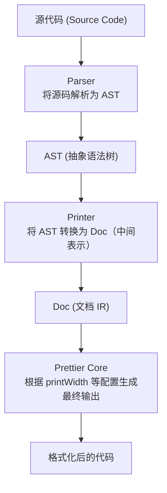

# Prettier 插件开发完全指南

> 本文以 `prettier-plugin-monkey` 为实例，详细讲解如何从零开发一个 Prettier 插件。

## 目录

1. [概述](#1-概述)
2. [核心概念](#2-核心概念)
3. [项目结构](#3-项目结构)
4. [四大核心接口详解](#4-四大核心接口详解)
5. [实战：实现 Parser](#5-实战实现-parser)
6. [实战：实现 Printer](#6-实战实现-printer)
7. [Doc Builders 详解](#7-doc-builders-详解)
8. [测试与调试](#8-测试与调试)
9. [发布与使用](#9-发布与使用)

---

## 1. 概述

### 1.1 什么是 Prettier 插件？

Prettier 是一个代码格式化工具，默认支持 JavaScript、TypeScript、CSS、HTML 等主流语言。通过插件机制，我们可以让 Prettier 支持任意自定义语言的格式化。

### 1.2 插件工作原理



### 1.3 为什么使用中间表示 (Doc)？

Prettier 不直接输出字符串，而是使用 Doc（Document IR）。这样做的好处是：

- **智能换行**：Prettier 会根据 `printWidth` 自动决定是否换行
- **一致性**：相同的 Doc 结构在任何配置下都能产生一致的格式化行为
- **可组合**：Doc 是可组合的数据结构，便于递归处理嵌套结构

---

## 2. 核心概念

### 2.1 插件必须导出的四个接口

| 接口 | 类型 | 说明 |
|------|------|------|
| `languages` | `SupportLanguage[]` | 定义支持的语言、文件扩展名等 |
| `parsers` | `Record<string, Parser>` | 解析器，将源码转换为 AST |
| `printers` | `Record<string, Printer>` | 打印器，将 AST 转换为 Doc |
| `options` | `Record<string, SupportOption>` | 自定义配置选项（可选） |

### 2.2 关键类型定义

```typescript
import type {
  Parser,
  Printer,
  SupportLanguage,
  SupportOption,
  AstPath,
  Doc,
  Options
} from 'prettier';
```

---

## 3. 项目结构

```
prettier-plugin-monkey/
├── src/
│   ├── index.ts        # 插件入口，导出四大接口
│   ├── language.ts     # 语言定义
│   ├── parser.ts       # 解析器实现
│   ├── printer.ts      # 打印器实现
│   ├── options.ts      # 自定义选项
│   └── types.ts        # AST 类型定义
├── tests/
│   ├── format.test.ts  # 测试文件
│   └── fixtures/       # 测试用例
├── package.json
└── tsconfig.json
```

### 3.1 package.json 关键配置

```json
{
  "name": "prettier-plugin-monkey",
  "main": "dist/index.js",
  "types": "dist/index.d.ts",
  "peerDependencies": {
    "prettier": "^3.0.0"
  },
  "dependencies": {
    "@gengjiawen/monkey-wasm": "^0.10.1"
  }
}
```

---

## 4. 四大核心接口详解

### 4.1 languages - 语言定义

```typescript
// src/language.ts
import type { SupportLanguage } from 'prettier';

export const languages: SupportLanguage[] = [
  {
    // 语言名称，显示在错误信息等地方
    name: 'Monkey',

    // 关联的解析器名称，必须与 parsers 中的 key 对应
    parsers: ['monkey'],

    // 支持的文件扩展名
    extensions: ['.monkey'],

    // VS Code 语言标识符（用于编辑器集成）
    vscodeLanguageIds: ['monkey'],
  },
];
```

**完整的 SupportLanguage 属性：**

| 属性 | 类型 | 说明 |
|------|------|------|
| `name` | `string` | 语言名称 |
| `parsers` | `string[]` | 关联的解析器 |
| `extensions` | `string[]` | 文件扩展名 |
| `filenames` | `string[]` | 精确匹配的文件名 |
| `aliases` | `string[]` | 语言别名 |
| `vscodeLanguageIds` | `string[]` | VS Code 语言 ID |
| `linguistLanguageId` | `number` | GitHub Linguist 语言 ID |
| `tmScope` | `string` | TextMate 作用域 |
| `aceMode` | `string` | Ace 编辑器模式 |
| `codemirrorMode` | `string` | CodeMirror 模式 |
| `codemirrorMimeType` | `string` | CodeMirror MIME 类型 |

### 4.2 parsers - 解析器

```typescript
// src/index.ts
import type { Parser, Options } from 'prettier';
import type { Program } from './types';
import { parse as parseMonkey, locStart, locEnd } from './parser';

const monkeyParser: Parser<Program> = {
  // 核心：解析函数（返回 Program AST）
  parse: (text: string, options: Options): Program => parseMonkey(text, options),

  // AST 格式标识符，必须与 printers 中的 key 对应
  astFormat: 'monkey-ast',

  // 获取节点起始位置 / 结束位置
  locStart,
  locEnd,

  // 可选：预处理源码
  // preprocess: (text: string) => text.trim(),
};

export const parsers = {
  monkey: monkeyParser,  // key 与 languages.parsers 对应
};
```

**Parser 接口详解：**

| 属性 | 类型 | 必需 | 说明 |
|------|------|------|------|
| `parse` | `(text, options) => AST` | ✅ | 将源码解析为 AST |
| `astFormat` | `string` | ✅ | AST 格式标识符 |
| `locStart` | `(node) => number` | ✅ | 返回节点起始位置 |
| `locEnd` | `(node) => number` | ✅ | 返回节点结束位置 |
| `preprocess` | `(text, options) => string` | ❌ | 预处理源码 |
| `hasPragma` | `(text) => boolean` | ❌ | 检查是否有 pragma 注释 |

### 4.3 printers - 打印器

```typescript
// src/index.ts
import type { Printer } from 'prettier';
import { print } from './printer';

// 最简实现只需要 print 函数
const monkeyPrinter: Printer = {
  print,
};

export const printers = {
  'monkey-ast': monkeyPrinter,  // key 与 parser.astFormat 对应
};
```

**Printer 接口详解：**

| 属性 | 类型 | 必需 | 说明 |
|------|------|------|------|
| `print` | `(path, options, print) => Doc` | ✅ | 核心打印函数 |
| `embed` | `(path, options) => Function \| null` | ❌ | 嵌入其他语言 |
| `preprocess` | `(ast, options) => ast` | ❌ | 预处理 AST |
| `insertPragma` | `(text) => string` | ❌ | 插入 pragma 注释 |
| `canAttachComment` | `(node) => boolean` | ❌ | 判断是否可附加注释 |
| `isBlockComment` | `(comment) => boolean` | ❌ | 判断是否是块注释 |
| `printComment` | `(path, options) => Doc` | ❌ | 打印注释 |
| `handleComments` | `object` | ❌ | 注释处理钩子 |

### 4.4 options - 自定义选项

```typescript
// src/options.ts
import type { SupportOption } from 'prettier';

export const options: Record<string, SupportOption> = {
  // 当前使用 Prettier 内置选项（printWidth, tabWidth, singleQuote 等）
  // 如需添加语言特定选项，可参考以下示例：
};
```

**自定义选项示例（供参考）：**

```typescript
export const options: Record<string, SupportOption> = {
  // boolean 类型示例
  monkeyExplicitSemicolons: {
    category: 'Format',
    type: 'boolean',
    default: true,
    description: 'Add explicit semicolons at the end of statements.',
    since: '1.0.0',
  },

  // choice 类型示例
  monkeyQuoteStyle: {
    category: 'Format',
    type: 'choice',
    default: 'double',
    description: 'Quote style for strings.',
    choices: [
      { value: 'double', description: 'Use double quotes' },
      { value: 'single', description: 'Use single quotes' },
    ],
  },
};
```

---

## 5. 实战：实现 Parser

### 5.1 使用现有解析器

最简单的方式是使用现有的解析库：

```typescript
// src/parser.ts
import { parse as wasmParse } from '@gengjiawen/monkey-wasm';
import { Program } from './types';

export function parse(text: string, options: any): Program {
  try {
    // 调用 WASM 解析器
    const astJson = wasmParse(text);
    const ast = JSON.parse(astJson);

    // 处理解析器返回的格式
    if (ast.Program) {
      return ast.Program;
    }
    return ast;
  } catch (error) {
    if (error instanceof Error) {
      throw new SyntaxError(`Monkey parse error: ${error.message}`);
    }
    throw error;
  }
}

export function locStart(node: any): number {
  return node.span?.start ?? 0;
}

export function locEnd(node: any): number {
  return node.span?.end ?? 0;
}
```

### 5.2 定义 AST 类型

```typescript
// src/types.ts

// 位置信息
export interface Span {
  start: number;
  end: number;
}

export interface Token {
  kind: TokenKind;
  span: Span;
}

export type TokenKind =
  | { type: 'PLUS' }
  | { type: 'MINUS' }
  | { type: 'ASTERISK' }
  | { type: 'SLASH' }
  | { type: 'BANG' }
  | { type: 'LT' }
  | { type: 'GT' }
  | { type: 'EQ' }
  | { type: 'NotEq' }
  | { type: 'ASSIGN' }
  | { type: 'IDENTIFIER'; value: { name: string } }
  | { type: string };

// 基础节点接口
export interface ASTNode {
  type: string;
  span?: Span;
}

// 程序根节点
export interface Program extends ASTNode {
  type: 'Program';
  body: ASTNode[];
}

// 语句类型
export interface LetStatement extends ASTNode {
  type: 'Let';
  identifier: Token;  // 注意：通过 identifier.kind.value.name 访问标识符名
  expr: ASTNode;
}

export interface ReturnStatement extends ASTNode {
  type: 'ReturnStatement';
  argument: ASTNode;
}

export interface BlockStatement extends ASTNode {
  type: 'BlockStatement';
  body: ASTNode[];
}

// 表达式类型
export interface Identifier extends ASTNode {
  type: 'IDENTIFIER';
  name: string;
}

export interface BinaryExpression extends ASTNode {
  type: 'BinaryExpression';
  op: Token;
  left: ASTNode;
  right: ASTNode;
}

export interface UnaryExpression extends ASTNode {
  type: 'UnaryExpression';
  op: Token;
  operand: ASTNode;
}

export interface IfExpression extends ASTNode {
  type: 'IF';  // 注意：不是 'IfExpression'
  condition: ASTNode;
  consequent: BlockStatement;
  alternate?: BlockStatement;
}

export interface FunctionDeclaration extends ASTNode {
  type: 'FunctionDeclaration';
  params: Identifier[];
  body: BlockStatement;
  name?: string;
}

export interface FunctionCall extends ASTNode {
  type: 'FunctionCall';
  callee: ASTNode;
  arguments: ASTNode[];
}

export interface IndexExpression extends ASTNode {
  type: 'Index';  // 注意：不是 'IndexExpression'
  object: ASTNode;
  index: ASTNode;
}

// 字面量类型
export interface IntegerLiteral extends ASTNode {
  type: 'Integer';
  raw: number;
}

export interface BooleanLiteral extends ASTNode {
  type: 'Boolean';
  raw: boolean;
}

export interface StringLiteral extends ASTNode {
  type: 'String';
  raw: string;
}

export interface ArrayLiteral extends ASTNode {
  type: 'Array';
  elements: ASTNode[];
}

export interface HashLiteral extends ASTNode {
  type: 'Hash';
  elements: [ASTNode, ASTNode][];
}

export type Literal =
  | IntegerLiteral
  | BooleanLiteral
  | StringLiteral
  | ArrayLiteral
  | HashLiteral;
```

### 5.3 locStart 和 locEnd 的重要性

这两个函数用于：
1. **错误定位**：Prettier 在解析错误时能准确指出问题位置
2. **注释附加**：确定注释应该附加到哪个节点
3. **范围格式化**：只格式化文件的一部分时需要

```typescript
// 简单实现
export function locStart(node: any): number {
  // 优先使用 span，其次尝试其他常见属性名
  return node.span?.start ?? node.start ?? node.loc?.start?.offset ?? 0;
}

export function locEnd(node: any): number {
  return node.span?.end ?? node.end ?? node.loc?.end?.offset ?? 0;
}
```

---

## 6. 实战：实现 Printer

### 6.1 print 函数的核心结构

```typescript
// src/printer.ts
import type { AstPath, Doc, Options } from 'prettier';

// 引入 Doc Builders
const { group, indent, line, softline, hardline, join, ifBreak } = require('prettier').doc.builders;

export function print(
  path: AstPath,           // AST 路径，用于遍历和访问节点
  options: Options,        // Prettier 配置选项
  print: (path: AstPath) => Doc  // 递归打印函数（注意与外层函数同名，这是 Prettier 的约定）
): Doc {
  const node = path.getValue();  // 获取当前节点

  if (!node) {
    return '';
  }

  // 根据节点类型分发处理
  switch (node.type) {
    case 'Program':
      return printProgram(node, path, print, options);
    case 'Let':
      return printLetStatement(node, path, print, options);
    case 'ReturnStatement':
      return printReturnStatement(node, path, print, options);
    case 'BlockStatement':
      return printBlockStatement(node, path, print, options);
    case 'IDENTIFIER':
      return printIdentifier(node);
    case 'UnaryExpression':
      return printUnaryExpression(node, path, print, options);
    case 'BinaryExpression':
      return printBinaryExpression(node, path, print, options);
    case 'IF':
      return printIfExpression(node, path, print, options);
    case 'FunctionDeclaration':
      return printFunctionDeclaration(node, path, print, options);
    case 'FunctionCall':
      return printFunctionCall(node, path, print, options);
    case 'Index':
      return printIndexExpression(node, path, print, options);
    case 'Integer':
    case 'Boolean':
    case 'String':
    case 'Array':
    case 'Hash':
      return printLiteral(node, path, print, options);
    default:
      console.warn('Unknown node type:', node);
      return '';
  }
}
```

### 6.2 AstPath 的使用

`AstPath` 是 Prettier 提供的工具，用于安全地遍历和操作 AST：

```typescript
// 获取当前节点
const node = path.getValue();

// 获取父节点
const parent = path.getParentNode();
const grandParent = path.getParentNode(1);

// 递归打印子节点
const childDoc = path.call(print, 'childProperty');

// 打印子节点数组
const childDocs = path.map(print, 'children');

// 遍历子节点数组（有更多控制）
const parts: Doc[] = [];
path.each((childPath) => {
  parts.push(print(childPath));
}, 'body');
```

### 6.3 打印各种节点类型

```typescript
// 打印程序（根节点）
function printProgram(
  node: Program,
  path: AstPath,
  print: (path: AstPath) => Doc,
  options: Options
): Doc {
  if (node.body.length === 0) {
    return '';
  }

  const parts: Doc[] = [];
  path.each((statementPath) => {
    parts.push(print(statementPath));
  }, 'body');

  // 语句之间用硬换行分隔，文件末尾加换行
  return [join(hardline, parts), hardline];
}

// 打印 let 语句
function printLetStatement(
  node: LetStatement,
  path: AstPath,
  print: (path: AstPath) => Doc,
  options: Options
): Doc {
  // 注意：identifier 是 Token 类型，需要通过 kind.value.name 访问
  const identifierName = (node.identifier.kind as any).value?.name || '';

  return group([
    'let ',
    identifierName,
    ' = ',
    path.call(print, 'expr'),  // 递归打印表达式
    ';',
  ]);
}

// 打印二元表达式
function printBinaryExpression(
  node: BinaryExpression,
  path: AstPath,
  print: (path: AstPath) => Doc,
  options: Options
): Doc {
  const operator = getTokenValue(node.op);

  // 嵌套的二元/一元表达式需要加括号
  const needsParens = (n: any): boolean => {
    return n && (n.type === 'BinaryExpression' || n.type === 'UnaryExpression');
  };

  const leftNeedsParens = needsParens(node.left);
  const rightNeedsParens = needsParens(node.right);

  return group([
    leftNeedsParens ? '(' : '',
    path.call(print, 'left'),
    leftNeedsParens ? ')' : '',
    ' ',
    operator,
    ' ',
    rightNeedsParens ? '(' : '',
    path.call(print, 'right'),
    rightNeedsParens ? ')' : '',
  ]);
}

// 打印 if 表达式
function printIfExpression(
  node: IfExpression,
  path: AstPath,
  print: (path: AstPath) => Doc,
  options: Options
): Doc {
  const parts: Doc[] = [
    'if (',
    path.call(print, 'condition'),
    ') ',
    path.call(print, 'consequent'),
  ];

  if (node.alternate) {
    parts.push(' else ', path.call(print, 'alternate'));
  }

  return group(parts);
}

// 打印代码块
function printBlockStatement(
  node: BlockStatement,
  path: AstPath,
  print: (path: AstPath) => Doc,
  options: Options
): Doc {
  if (node.body.length === 0) {
    return '{}';
  }

  const parts: Doc[] = [];
  path.each((statementPath) => {
    parts.push(print(statementPath));
  }, 'body');

  return group([
    '{',
    indent([hardline, join(hardline, parts)]),
    hardline,
    '}',
  ]);
}

// 打印函数声明
function printFunctionDeclaration(
  node: FunctionDeclaration,
  path: AstPath,
  print: (path: AstPath) => Doc,
  options: Options
): Doc {
  const params: Doc[] = [];

  path.each((paramPath: AstPath) => {
    params.push(print(paramPath));
  }, 'params');

  const paramsDoc = params.length > 0 ? join(', ', params) : '';

  return group([
    'fn(',
    paramsDoc,
    ') ',
    path.call(print, 'body'),
  ]);
}

// 打印函数调用
function printFunctionCall(
  node: FunctionCall,
  path: AstPath,
  print: (path: AstPath) => Doc,
  options: Options
): Doc {
  const args: Doc[] = [];

  path.each((argPath: AstPath) => {
    args.push(print(argPath));
  }, 'arguments');

  const argsDoc = args.length > 0 ? join([',', line], args) : '';

  return group([
    path.call(print, 'callee'),
    '(',
    indent([softline, argsDoc]),
    softline,
    ')',
  ]);
}

// 打印数组字面量
function printArrayLiteral(
  node: ArrayLiteral,
  path: AstPath,
  print: (path: AstPath) => Doc,
  options: Options
): Doc {
  if (node.elements.length === 0) {
    return '[]';
  }

  const elements: Doc[] = [];

  path.each((elementPath: AstPath) => {
    elements.push(print(elementPath));
  }, 'elements');

  const shouldBreak = node.elements.length > 3;

  return group(
    [
      '[',
      indent([
        shouldBreak ? hardline : softline,
        join([',', line], elements),
        options.trailingComma === 'none' ? '' : ifBreak(','),
      ]),
      shouldBreak ? hardline : softline,
      ']',
    ],
    { shouldBreak }
  );
}

// 打印 return 语句
function printReturnStatement(
  node: ReturnStatement,
  path: AstPath,
  print: (path: AstPath) => Doc,
  options: Options
): Doc {
  return group(['return ', path.call(print, 'argument'), ';']);
}

// 打印标识符
function printIdentifier(node: Identifier): Doc {
  return node.name;
}

// 打印一元表达式
function printUnaryExpression(
  node: UnaryExpression,
  path: AstPath,
  print: (path: AstPath) => Doc,
  options: Options
): Doc {
  const operator = getTokenValue(node.op);
  return group(['(', operator, path.call(print, 'operand'), ')']);
}

// 打印索引表达式
function printIndexExpression(
  node: IndexExpression,
  path: AstPath,
  print: (path: AstPath) => Doc,
  options: Options
): Doc {
  return group([
    '(',
    path.call(print, 'object'),
    '[',
    path.call(print, 'index'),
    ']',
    ')',
  ]);
}

// 打印字面量（分发到具体类型）
function printLiteral(
  node: Literal,
  path: AstPath,
  print: (path: AstPath) => Doc,
  options: Options
): Doc {
  switch (node.type) {
    case 'Integer':
      return String((node as IntegerLiteral).raw);
    case 'Boolean':
      return String((node as BooleanLiteral).raw);
    case 'String': {
      const str = (node as StringLiteral).raw;
      const quote = options.singleQuote ? "'" : '"';
      return `${quote}${str}${quote}`;
    }
    case 'Array':
      return printArrayLiteral(node as ArrayLiteral, path, print, options);
    case 'Hash':
      return printHashLiteral(node as HashLiteral, path, print, options);
    default:
      return '';
  }
}

// 打印哈希字面量
function printHashLiteral(
  node: HashLiteral,
  path: AstPath,
  print: (path: AstPath) => Doc,
  options: Options
): Doc {
  if (node.elements.length === 0) {
    return '{}';
  }

  const pairs: Doc[] = [];

  node.elements.forEach((_, index) => {
    const key = path.call(print, 'elements', index, 0);
    const value = path.call(print, 'elements', index, 1);

    pairs.push(group([key, ': ', value]));
  });

  const shouldBreak = node.elements.length > 2;

  return group(
    [
      '{',
      options.bracketSpacing ? ifBreak('', ' ') : '',
      indent([
        shouldBreak ? hardline : softline,
        join([',', line], pairs),
        options.trailingComma === 'none' ? '' : ifBreak(','),
      ]),
      shouldBreak ? hardline : softline,
      options.bracketSpacing ? ifBreak('', ' ') : '',
      '}',
    ],
    { shouldBreak }
  );
}

// Token 值转换辅助函数
function getTokenValue(token: any): string {
  const kind = token.kind;

  switch (kind.type) {
    case 'PLUS':    return '+';
    case 'MINUS':   return '-';
    case 'ASTERISK': return '*';
    case 'SLASH':   return '/';
    case 'BANG':    return '!';
    case 'LT':     return '<';
    case 'GT':     return '>';
    case 'EQ':     return '==';
    case 'NotEq':  return '!=';
    case 'ASSIGN': return '=';
    default:       return '';
  }
}
```

---

## 7. Doc Builders 详解

### 7.1 基本 Builders

```typescript
const {
  // 文本和基础结构
  concat,      // 已废弃，直接使用数组 [...] 代替

  // 换行相关
  line,        // 可能换行或空格
  softline,    // 可能换行或无内容
  hardline,    // 强制换行
  literalline, // 强制换行（不考虑缩进）

  // 结构相关
  group,       // 分组，智能决定是否展开
  indent,      // 增加缩进
  dedent,      // 减少缩进
  align,       // 对齐

  // 辅助工具
  join,        // 连接多个 Doc
  fill,        // 填充模式（用于文本换行）
  ifBreak,     // 条件内容（根据是否换行决定）
  breakParent, // 强制父 group 换行

  // 行尾/行首
  lineSuffix,  // 行尾添加内容
  lineSuffixBoundary, // 行尾边界
} = require('prettier').doc.builders;
```

### 7.2 换行 Builders 对比

| Builder | group 未展开时 | group 展开时 | 说明 |
|---------|----------------|-------------|------|
| `line` | 空格 ` ` | 换行 + 缩进 | 最常用，在空格和换行间切换 |
| `softline` | 无内容 | 换行 + 缩进 | 适合括号内侧等不需要空格的位置 |
| `hardline` | 始终换行 | 始终换行 | 无论 group 是否展开都强制换行 |
| `literalline` | 始终换行 | 始终换行 | 强制换行且不添加缩进 |

### 7.3 group 的工作原理

```typescript
// group 会尝试将内容放在一行
// 如果超过 printWidth，就展开换行

// 示例：函数调用
group([
  'functionName(',
  indent([
    softline,           // 不换行时无内容，换行时换行
    'arg1,',
    line,               // 不换行时空格，换行时换行
    'arg2',
  ]),
  softline,
  ')',
])

// 不换行: functionName(arg1, arg2)
// 换行:
// functionName(
//   arg1,
//   arg2
// )
```

### 7.4 ifBreak 的使用

```typescript
// 根据 group 是否换行来决定输出内容
group([
  '[',
  indent([
    softline,
    'item1,',
    line,
    'item2',
    ifBreak(',', ''),  // 换行时添加尾逗号，不换行时不添加
  ]),
  softline,
  ']',
])
```

### 7.5 join 的使用

```typescript
// 用分隔符连接多个 Doc
const items = ['a', 'b', 'c'];

join(', ', items)          // "a, b, c"
join([',', line], items)   // 换行时每个元素一行
join(hardline, items)      // 每个元素单独一行
```

### 7.6 实用模式

```typescript
// 模式 1：可能换行的列表
function printList(items: Doc[]): Doc {
  return group([
    '(',
    indent([softline, join([',', line], items)]),
    softline,
    ')',
  ]);
}

// 模式 2：强制换行的块
function printBlock(statements: Doc[]): Doc {
  return [
    '{',
    indent([hardline, join(hardline, statements)]),
    hardline,
    '}',
  ];
}

// 模式 3：带尾逗号的数组
function printArray(elements: Doc[], shouldBreak: boolean): Doc {
  return group(
    [
      '[',
      indent([
        softline,
        join([',', line], elements),
        ifBreak(',', ''),
      ]),
      softline,
      ']',
    ],
    { shouldBreak }
  );
}
```

---

## 8. 测试与调试

### 8.1 使用 Vitest 测试

```typescript
// tests/format.test.ts
import { describe, it, expect } from 'vitest';
import * as prettier from 'prettier';
import plugin from '../src/index';

describe('prettier-plugin-monkey', () => {
  async function format(code: string, options = {}) {
    return prettier.format(code, {
      parser: 'monkey',
      plugins: [plugin],
      ...options,
    });
  }

  it('formats let statements', async () => {
    const input = 'let x=5;';
    const expected = 'let x = 5;\n';
    expect(await format(input)).toBe(expected);
  });

  it('formats function declarations', async () => {
    const input = 'let add=fn(a,b){a+b};';
    const expected = `let add = fn(a, b) {
  a + b
};
`;
    expect(await format(input)).toBe(expected);
  });

  it('respects singleQuote option', async () => {
    const input = 'let s = "hello";';
    const result = await format(input, { singleQuote: true });
    expect(result).toContain("'hello'");
  });
});
```

### 8.2 快照测试

```typescript
// tests/snapshot.test.ts
import { describe, it, expect } from 'vitest';
import { format } from 'prettier';
import plugin from '../src/index';
import * as fs from 'fs';
import * as path from 'path';

describe('snapshot tests', () => {
  const fixturesDir = path.join(__dirname, 'fixtures');
  const inputDir = path.join(fixturesDir, 'input');

  const files = fs.readdirSync(inputDir).filter(f => f.endsWith('.monkey'));

  files.forEach(file => {
    it(`formats ${file} correctly`, async () => {
      const input = fs.readFileSync(path.join(inputDir, file), 'utf-8');
      const result = await format(input, {
        parser: 'monkey',
        plugins: [plugin],
      });
      expect(result).toMatchSnapshot();
    });
  });
});
```

### 8.3 调试技巧

```typescript
// 1. 打印 AST 结构
export function parse(text: string, options: any): Program {
  const ast = actualParse(text);
  console.log('AST:', JSON.stringify(ast, null, 2));
  return ast;
}

// 2. 打印 Doc 结构
export function print(path: AstPath, options: Options, print: Function): Doc {
  const node = path.getValue();
  const doc = actualPrint(path, options, print);
  console.log('Node:', node.type, 'Doc:', JSON.stringify(doc));
  return doc;
}

// 3. 使用 prettier.doc.printer.printDocToString 查看最终输出
const { printDocToString } = require('prettier').doc.printer;
const result = printDocToString(doc, { printWidth: 80, tabWidth: 2 });
console.log('Output:', result.formatted);
```

---

## 9. 发布与使用

### 9.1 插件命名约定

- 官方推荐命名：`prettier-plugin-xxx`
- Prettier 会自动发现 `prettier-plugin-*` 或 `@*/prettier-plugin-*` 包

### 9.2 package.json 完整示例

```json
{
  "name": "prettier-plugin-monkey",
  "version": "0.1.0",
  "description": "Prettier plugin for Monkey programming language",
  "main": "dist/index.js",
  "types": "dist/index.d.ts",
  "files": [
    "dist"
  ],
  "keywords": [
    "prettier",
    "plugin",
    "monkey",
    "monkeylang",
    "formatter"
  ],
  "peerDependencies": {
    "prettier": "^3.0.0"
  },
  "dependencies": {
    "@gengjiawen/monkey-wasm": "^0.10.1"
  },
  "devDependencies": {
    "@types/node": "^20.0.0",
    "prettier": "^3.0.0",
    "typescript": "^5.0.0",
    "vitest": "^1.0.0"
  },
  "scripts": {
    "build": "tsc",
    "test": "vitest",
    "dev": "tsc --watch",
    "prepublishOnly": "npm run build"
  }
}
```

### 9.3 用户使用方式

```bash
# 安装
npm install --save-dev prettier prettier-plugin-monkey

# 使用 CLI
prettier --write "**/*.monkey"

# 使用配置文件 .prettierrc
{
  "plugins": ["prettier-plugin-monkey"],
  "printWidth": 80,
  "tabWidth": 2
}
```

### 9.4 程序化使用

```typescript
import * as prettier from 'prettier';

const code = `let add=fn(a,b){a+b};`;

const formatted = await prettier.format(code, {
  parser: 'monkey',
  plugins: ['prettier-plugin-monkey'],
  printWidth: 80,
  tabWidth: 2,
  singleQuote: false,
});

console.log(formatted);
// Output:
// let add = fn(a, b) {
//   a + b
// };
```

---

## 总结

实现一个 Prettier 插件的核心步骤：

1. **定义语言** (`languages`)：声明文件扩展名和解析器关联
2. **实现解析器** (`parsers`)：将源码转换为 AST，提供位置信息函数
3. **实现打印器** (`printers`)：递归遍历 AST，使用 Doc Builders 生成格式化输出
4. **可选配置** (`options`)：添加语言特定的格式化选项

关键要点：
- Parser 和 Printer 通过 `astFormat` 关联
- 使用 `AstPath` 安全地遍历和递归打印 AST
- 利用 `group`、`indent`、`line` 等 Doc Builders 实现智能换行
- 充分测试各种边界情况

---

## 参考资料

- [Prettier Plugin API 官方文档](https://prettier.io/docs/en/plugins.html)
- [prettier-plugin-monkey 源码](../packages/prettier-plugin-monkey/src/)
- [Writing An Interpreter In Go](https://interpreterbook.com/) - Monkey 语言原书
