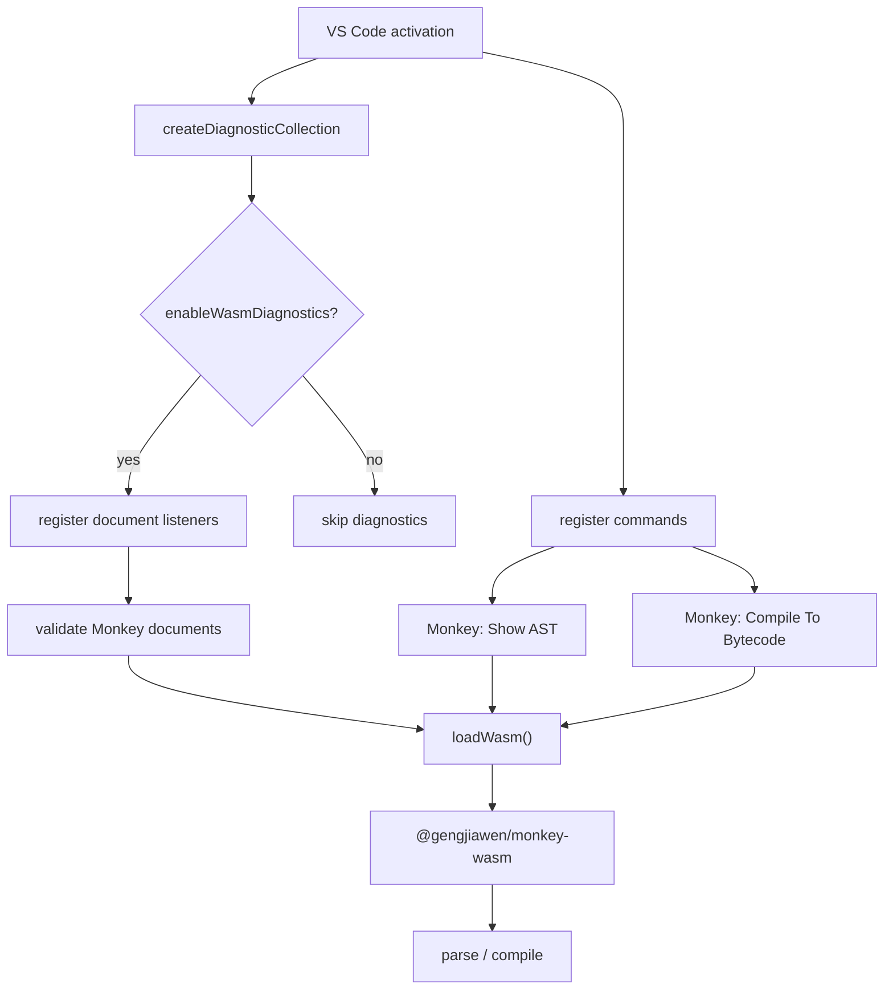
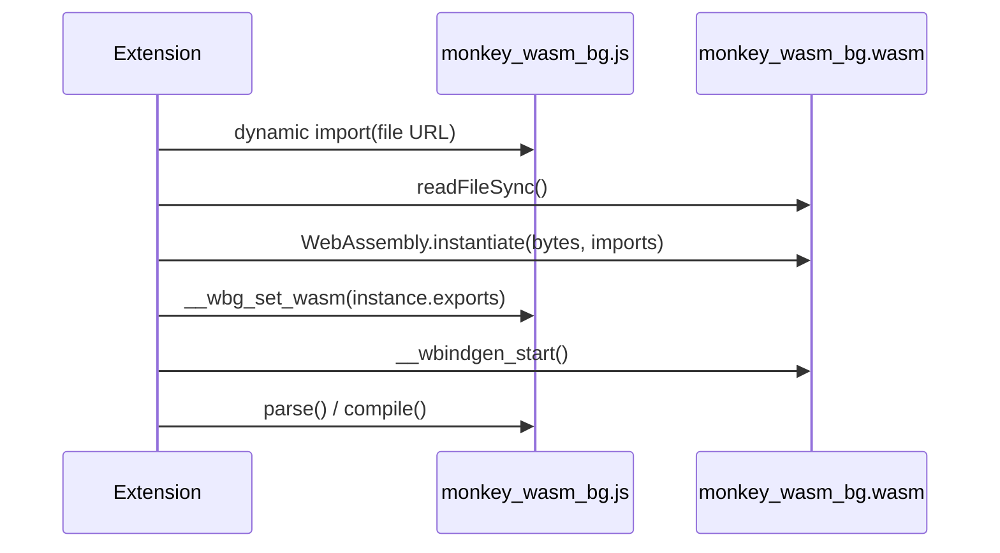
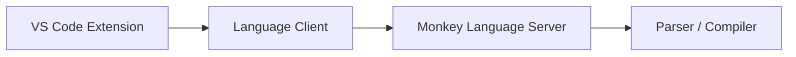

# VS Code Extension 设计实现文档

> 本文说明 `packages/vscode-extension` 的设计目标、实现结构、WASM 集成、打包流程和维护策略。

## 目录

1. [概述](#1-概述)
2. [功能范围](#2-功能范围)
3. [项目结构](#3-项目结构)
4. [扩展 Manifest 设计](#4-扩展-manifest-设计)
5. [运行时架构](#5-运行时架构)
6. [WASM 加载策略](#6-wasm-加载策略)
7. [诊断与命令实现](#7-诊断与命令实现)
8. [语言资源](#8-语言资源)
9. [构建与打包](#9-构建与打包)
10. [版本同步与发布维护](#10-版本同步与发布维护)
11. [测试与验证](#11-测试与验证)
12. [后续演进](#12-后续演进)

---

## 1. 概述

`monkey-extension` 是 Monkey 语言的 VS Code 扩展，目标是把仓库已有的 Monkey 语言能力带到编辑器中，提供基础编辑体验和轻量交互能力。

扩展当前覆盖三类能力：

- 语言识别：让 VS Code 识别 `.monkey` 文件为 Monkey 语言。
- 编辑辅助：提供 TextMate 语法高亮、括号/注释配置和代码片段。
- 运行时能力：通过 `@gengjiawen/monkey-wasm` 提供解析诊断、AST 查看和字节码编译命令。

整体设计优先保持扩展轻量，不在 extension 包内重新构建 Rust/WASM，而是依赖已经发布到 npm 的 `@gengjiawen/monkey-wasm`。

---

## 2. 功能范围

### 2.1 已实现能力

| 能力       | 入口                                 | 说明                                         |
| ---------- | ------------------------------------ | -------------------------------------------- |
| 语言注册   | `package.json#contributes.languages` | 将 `.monkey` 文件关联到 `monkey` language id |
| 语法高亮   | `syntaxes/monkey.tmLanguage.json`    | 基于 TextMate grammar 的基础 token 高亮      |
| 语言配置   | `language-configuration.json`        | 配置注释、括号、自动闭合对                   |
| 代码片段   | `snippets/monkey.json`               | 提供常用 Monkey 语法片段                     |
| 解析诊断   | `src/extension.ts`                   | 保存/打开/编辑时调用 WASM parser             |
| 查看 AST   | `monkey.showAST`                     | 将当前文档解析为 JSON AST 并在新编辑器展示   |
| 编译字节码 | `monkey.compileToBytecode`           | 将当前文档编译为字节码文本并在新编辑器展示   |
| VSIX 打包  | `scripts/package.js`                 | 在临时目录中安装生产依赖并生成可安装包       |

### 2.2 暂不覆盖的能力

当前版本不实现以下能力：

- Language Server Protocol。
- 精准 range 诊断。
- hover、completion、rename、go to definition。
- 编辑器内运行 Monkey 程序。
- Marketplace 自动发布流程。

这些能力需要更稳定的语义模型、源码位置 span 和更完整的 WASM API 支撑。

---

## 3. 项目结构

```
packages/vscode-extension/
├── .vscodeignore                 # VSIX 打包排除规则
├── README.md                     # 扩展使用说明
├── language-configuration.json   # VS Code 语言配置
├── package.json                  # VS Code extension manifest
├── scripts/
│   ├── build.js                  # 从 workspace root 调用 TypeScript
│   └── package.js                # 生成 VSIX 的稳定打包脚本
├── snippets/
│   └── monkey.json               # Monkey 代码片段
├── src/
│   └── extension.ts              # 扩展运行时入口
├── syntaxes/
│   └── monkey.tmLanguage.json    # TextMate grammar
└── tsconfig.json                 # 扩展 TypeScript 配置
```

生成物不进入 Git：

- `dist/`
- `node_modules/`
- `*.vsix`

其中 `dist/` 是 TypeScript 编译输出，`*.vsix` 是本地打包产物，`node_modules/` 由包管理器安装生成。

---

## 4. 扩展 Manifest 设计

VS Code extension 的主要声明在 `packages/vscode-extension/package.json` 中。

### 4.1 基础信息

```json
{
  "name": "monkey-extension",
  "displayName": "Monkey Language",
  "version": "0.12.0",
  "engines": {
    "vscode": "^1.74.0"
  },
  "main": "dist/extension.js"
}
```

关键点：

- `main` 指向编译后的 CommonJS 入口 `dist/extension.js`。
- `engines.vscode` 当前设为 `^1.74.0`，对应 `@types/vscode@1.74.0`。
- extension 版本和仓库根版本保持一致，由 release bump 脚本同步。

### 4.2 Activation Events

```json
[
  "onLanguage:monkey",
  "onCommand:monkey.compileToBytecode",
  "onCommand:monkey.showAST"
]
```

扩展只在需要时激活：

- 打开 Monkey 文件时激活，用于诊断。
- 执行 AST 或字节码命令时激活。

这样可以避免 VS Code 启动时加载扩展。

### 4.3 Contributions

扩展贡献项包括：

- `languages`：注册 `monkey` 语言和 `.monkey` 扩展名。
- `grammars`：注册 TextMate grammar。
- `snippets`：注册 Monkey snippet。
- `commands`：注册 AST 和字节码命令。
- `configuration`：注册 `monkey.enableWasmDiagnostics`。

`monkey.enableWasmDiagnostics` 默认为 `true`。关闭后扩展仍保留命令能力，但不会在打开或编辑文档时自动调用 parser。

---

## 5. 运行时架构

扩展运行时集中在 `src/extension.ts`。



核心原则：

- 扩展激活时不立即加载 WASM。
- 第一次诊断或命令执行时才调用 `loadWasm()`。
- WASM module 通过 Promise 缓存，避免重复初始化。
- 所有用户可见错误通过 VS Code diagnostic 或 error message 展示。

---

## 6. WASM 加载策略

### 6.1 为什么不直接 `import('@gengjiawen/monkey-wasm')`

扩展 TypeScript 当前编译为 CommonJS：

```json
{
  "module": "commonjs"
}
```

如果直接写：

```typescript
await import('@gengjiawen/monkey-wasm')
```

TypeScript 在 CommonJS 输出中可能会降级为 `require('@gengjiawen/monkey-wasm')`。而 `@gengjiawen/monkey-wasm` 是 ESM 包，并且入口依赖 `.wasm` module import：

```js
import * as wasm from './monkey_wasm_bg.wasm'
```

这种加载方式依赖 Node/Electron 对 WASM ESM import 的支持，跨 VS Code 版本不够稳定。

### 6.2 当前实现

当前扩展手动加载 wasm-bindgen 生成物：

1. 通过 `require.resolve()` 找到包内文件：
   - `monkey_wasm_bg.js`
   - `monkey_wasm_bg.wasm`
2. 通过 `new Function('specifier', 'return import(specifier)')` 保留原生 dynamic import。
3. 用 `pathToFileURL()` 将 bindings 文件路径转为 file URL。
4. 用 `readFileSync()` 读取 `.wasm` 字节。
5. 调用 `WebAssembly.instantiate(bytes, imports)`。
6. 调用 bindings 的 `__wbg_set_wasm(instance.exports)`。
7. 如存在 `__wbindgen_start`，调用它完成初始化。

简化流程如下：



### 6.3 依赖布局

运行时依赖来自 npm：

```json
{
  "dependencies": {
    "@gengjiawen/monkey-wasm": "^0.12.0"
  }
}
```

选择 npm 包而不是 `workspace:*` 的原因：

- VSIX 打包需要包含运行时依赖。
- `wasm/pkg` 是生成物，不能假设每个开发者或 CI 环境都已经构建。
- `vsce` 和 npm 对 pnpm workspace symlink 的处理不适合作为最终 VSIX 依赖来源。

---

## 7. 诊断与命令实现

### 7.1 诊断流程

诊断只对 `languageId === 'monkey'` 的文档运行。

触发时机：

- 文档打开：`onDidOpenTextDocument`
- 文档编辑：`onDidChangeTextDocument`
- 文档保存：`onDidSaveTextDocument`
- 扩展激活时已经打开的 Monkey 文档

当前诊断实现调用：

```typescript
mod.parse(text)
```

如果解析成功，清空文档 diagnostics。如果解析失败，把错误消息放到第一行第一列。

当前没有精准 range 的原因是 WASM parser 目前返回的是 AST JSON 字符串或抛出的错误文本，错误中没有稳定的源码 span。后续可以通过扩展 WASM API 支持结构化错误。

### 7.2 Show AST 命令

命令 id：

```text
monkey.showAST
```

行为：

1. 读取当前 active editor 文本。
2. 调用 `parse(text)`。
3. 打开一个临时 JSON 文档。
4. 将 AST JSON 作为内容展示。

### 7.3 Compile To Bytecode 命令

命令 id：

```text
monkey.compileToBytecode
```

行为：

1. 读取当前 active editor 文本。
2. 调用 `compile(text)`。
3. 打开一个临时 text 文档。
4. 将字节码文本作为内容展示。

---

## 8. 语言资源

### 8.1 TextMate Grammar

`syntaxes/monkey.tmLanguage.json` 提供基础语法高亮规则，覆盖：

- 注释。
- 字符串。
- 数字。
- 关键字。
- 内置标识符。
- 运算符。

TextMate grammar 只负责词法级高亮，不参与 parser 诊断，也不理解语义。

### 8.2 Language Configuration

`language-configuration.json` 配置：

- 行注释：`//`
- 块注释：`/* */`
- 括号对：`()`, `[]`, `{}`
- 自动闭合对。
- surrounding pairs。

这些配置由 VS Code 编辑器原生消费，用于括号匹配和自动补全。

### 8.3 Snippets

`snippets/monkey.json` 提供常用模板，例如：

- `let`
- `fn`
- `if`
- `ifelse`

snippet 只依赖 language id，不依赖扩展运行时代码。

---

## 9. 构建与打包

### 9.1 Build

推荐命令：

```bash
pnpm -C packages/vscode-extension run build
```

脚本定义：

```json
{
  "build": "node scripts/build.js"
}
```

`scripts/build.js` 不直接依赖 extension 子目录下的 `.bin/tsc`，而是从 workspace root 查找：

```text
node_modules/.bin/tsc
```

这样做是为了避免 pnpm 在某些生命周期或 production install 状态下裁剪子包 devDependencies，导致 `tsc` 或类型包不可用。

### 9.2 Package

推荐命令：

```bash
pnpm -C packages/vscode-extension run package
```

`scripts/package.js` 的流程：

1. 调用 build 脚本生成 `dist/`。
2. 创建临时 staging 目录。
3. 复制扩展运行所需文件：
   - `.vscodeignore`
   - `README.md`
   - `dist/`
   - `language-configuration.json`
   - `snippets/`
   - `syntaxes/`
4. 从仓库根复制 `LICENSE`。
5. 写入精简后的 `package.json`，去掉 `devDependencies` 和 `scripts`。
6. 在 staging 目录执行：

   ```bash
   npm install --omit=dev --package-lock=false --ignore-scripts
   ```

7. 在 staging 目录执行：

   ```bash
   vsce package
   ```

8. 将生成的 `.vsix` 复制回 `packages/vscode-extension/`。

### 9.3 为什么使用 staging 目录

直接在 pnpm workspace 子包中运行 `vsce package` 容易遇到两个问题：

- `node_modules` 是 pnpm symlink 布局，`vsce` 对依赖收集不总是符合最终 VSIX 预期。
- workspace 依赖或 generated package 可能不会被正确包含。

staging 目录使用 npm 安装生产依赖，生成更接近普通发布包的目录结构。这样 VSIX 中会包含：

```text
extension/
├── dist/extension.js
└── node_modules/@gengjiawen/monkey-wasm/
    ├── monkey_wasm_bg.js
    └── monkey_wasm_bg.wasm
```

### 9.4 VSIX 排除规则

`.vscodeignore` 排除开发期文件：

```gitignore
src/**
scripts/**
tsconfig.json
*.vsix
```

`dist/` 不排除，因为它是 extension runtime 入口。

---

## 10. 版本同步与发布维护

### 10.1 Extension 版本

`packages/vscode-extension/package.json#version` 与仓库根 `package.json#version` 保持一致。

版本同步由 `scripts/bump_cargo_packages.ts` 维护。release bump 时该脚本会同步：

- Rust workspace crate 版本。
- Playground 的 `@gengjiawen/monkey-wasm` workspace range。
- `prettier-plugin-monkey` 的 package 版本和 wasm 依赖。
- `vscode-extension` 的 package 版本和 wasm 依赖。
- `pnpm-lock.yaml`。

### 10.2 WASM 依赖版本

VS Code extension 使用发布后的 npm 依赖：

```json
{
  "@gengjiawen/monkey-wasm": "^0.12.0"
}
```

当仓库版本升级到 `x.y.z` 时，release 脚本会同步为：

```json
{
  "@gengjiawen/monkey-wasm": "^x.y.z"
}
```

### 10.3 pnpm v11 build approval

`pnpm-workspace.yaml` 中显式配置了允许执行 install/build 脚本的依赖：

```yaml
allowBuilds:
  '@swc/core': true
  '@vscode/vsce-sign': true
  esbuild: true
  keytar: true
```

这样可以避免 pnpm v11 在非交互环境下因为 build script approval 中断安装。

---

## 11. 测试与验证

### 11.1 常规验证命令

```bash
pnpm -C packages/vscode-extension run build
pnpm -C packages/vscode-extension run package
```

### 11.2 VSIX 内容检查

生成 VSIX 后可以检查关键 runtime 文件：

```bash
unzip -l packages/vscode-extension/monkey-extension-0.12.0.vsix \
  | rg 'extension/(dist/extension.js$|node_modules/@gengjiawen/monkey-wasm/monkey_wasm_bg.wasm$|node_modules/@gengjiawen/monkey-wasm/monkey_wasm_bg.js$|package.json$|LICENSE.txt$)'
```

期望至少包含：

- `extension/dist/extension.js`
- `extension/package.json`
- `extension/LICENSE.txt`
- `extension/node_modules/@gengjiawen/monkey-wasm/monkey_wasm_bg.js`
- `extension/node_modules/@gengjiawen/monkey-wasm/monkey_wasm_bg.wasm`

### 11.3 手动 WASM smoke test

可以用 Node 验证手动加载路径是否能执行 parser/compiler：

```bash
node - <<'NODE'
const { readFileSync } = require('fs')
const { pathToFileURL } = require('url')
const dynamicImport = new Function('specifier', 'return import(specifier)')

async function main() {
  const bindingsPath = require.resolve(
    '@gengjiawen/monkey-wasm/monkey_wasm_bg.js',
    { paths: ['packages/vscode-extension'] }
  )
  const wasmPath = require.resolve(
    '@gengjiawen/monkey-wasm/monkey_wasm_bg.wasm',
    { paths: ['packages/vscode-extension'] }
  )
  const bindings = await dynamicImport(pathToFileURL(bindingsPath).href)
  const { instance } = await WebAssembly.instantiate(readFileSync(wasmPath), {
    './monkey_wasm_bg.js': bindings,
  })
  bindings.__wbg_set_wasm(instance.exports)
  instance.exports.__wbindgen_start()
  console.log(bindings.parse('let x = 1;').includes('Program'))
  console.log(bindings.compile('let x = 1;').length > 0)
}

main().catch((error) => {
  console.error(error)
  process.exit(1)
})
NODE
```

### 11.4 仓库级验证

扩展改动通常还应跑：

```bash
./node_modules/.bin/prettier --check \
  docs/vscode-extension-design.md \
  packages/vscode-extension/package.json \
  packages/vscode-extension/scripts/build.js \
  packages/vscode-extension/scripts/package.js \
  packages/vscode-extension/src/extension.ts

git diff --check
cargo test
```

---

## 12. 后续演进

### 12.1 结构化诊断

当前诊断只能把错误放到第一行第一列。更好的方案是在 Rust parser 或 WASM wrapper 中返回结构化错误：

```typescript
type MonkeyDiagnostic = {
  message: string
  startLine: number
  startColumn: number
  endLine: number
  endColumn: number
}
```

这样 VS Code 可以标记精确源码范围。

### 12.2 Language Server

当需要 hover、completion、definition、rename 等语义能力时，可以引入 LSP：



LSP 会增加架构复杂度，但可以把编辑器协议和语言能力解耦，适合更完整的 IDE 能力。

### 12.3 Marketplace 发布

当前扩展可以打包为 VSIX。若要发布到 Marketplace，还需要补齐：

- 实际 publisher。
- icon、gallery banner 等展示信息。
- changelog。
- CI 中的 `vsce publish` 或 `ovsx publish` 流程。
- 发布 token 管理。

### 12.4 WASM 包形态优化

后续可以考虑让 `@gengjiawen/monkey-wasm` 同时发布适合 Node/CommonJS extension host 的入口，例如：

- 显式 Node target。
- CommonJS wrapper。
- 非实验性的 `.wasm` 加载 API。

这样 VS Code extension 可以减少当前手动初始化 wasm-bindgen bindings 的代码。
