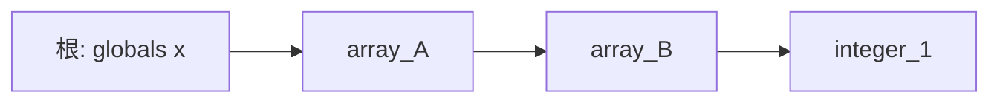
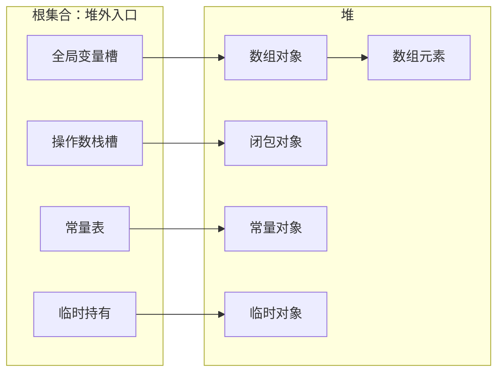
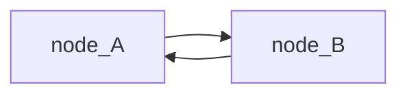
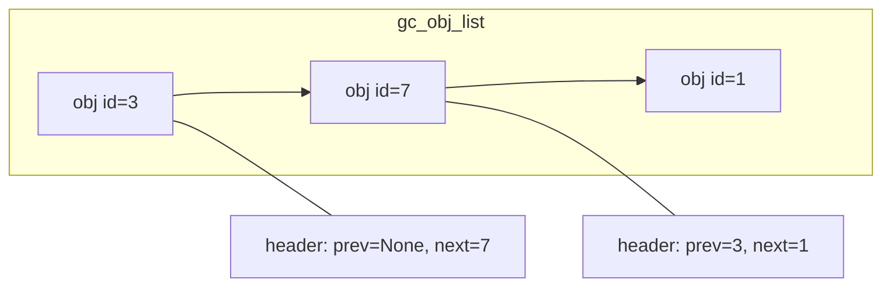
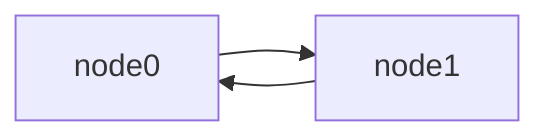
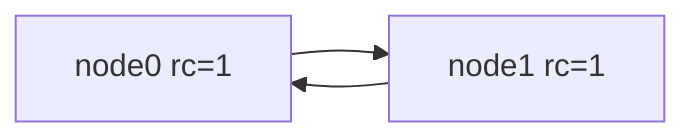
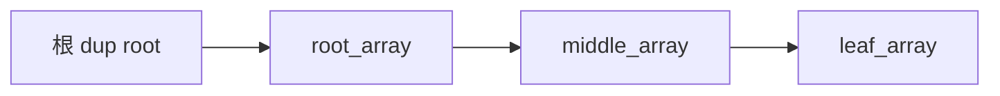
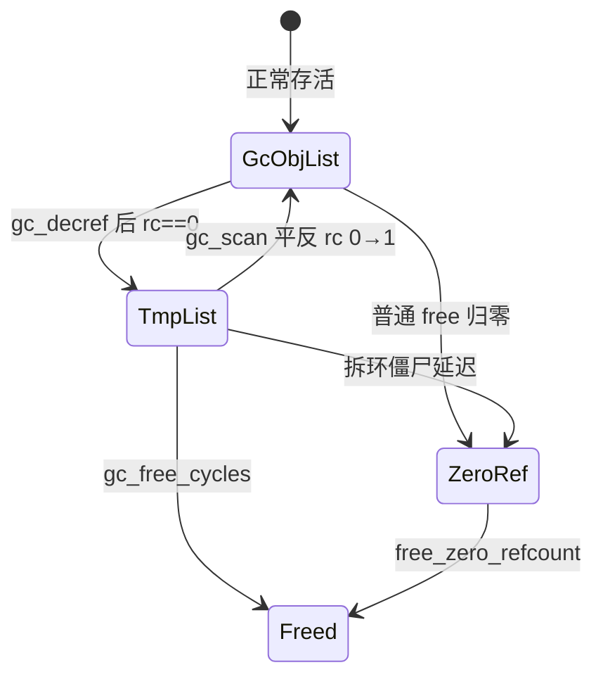
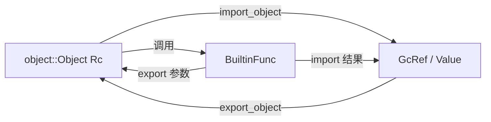
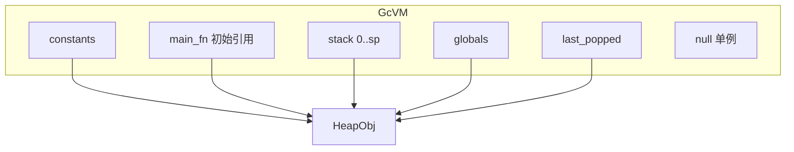

# 给 Monkey VM 加上 GC

## 行文原则

这份报告是一份**概念先行、测试驱动**的实现教程。假设你会 Rust，但没有 GC 背景。读的时候按下面几条预期来：

1. **先讲概念，再写代码。** 每一章开头先用对象图和日常类比把依赖的概念讲清楚，再贴测试、再落到实现。不会在第 6 章才第一次解释"根"是什么。
2. **测试即规格。** 正文里的测试都来自 `gc/` crate 的真实代码。每个测试都按 Given / When / Then 逐行解读：它在钉什么行为、为什么这个断言非有不可。
3. **手工推演。** 复杂算法配 ref_count 逐步变化表或对象图快照，拿纸笔能跟着算——证明"不是碰巧对的"。
4. **语言平实，偶尔口语化。** 读起来像有经验的工程师带你做项目，会有"别问我们怎么知道的""现在还不值得"这类判断和妥协。
5. **聚焦最小可用系统。** 只做到让 `monkey-gc` 跑起来、测得过为止。没做的会在后面坦白。

算法参考 QuickJS（`JS_RunGC`、`gc_decref`、`gc_scan`、`gc_free_cycles`），函数名刻意保持一致，方便对照原版源码。

---

## 0. 导读

### 0.1 这份报告讲什么

我们的 Monkey 字节码 VM 一直用 `Rc<Object>` 管理堆对象。它工作得不错——直到对象图里出现循环。两个对象互相持有，引用计数永远掉不到 0，内存就这么漏了。

这份报告记录我们怎么在 `gc/` crate 里从零搭一套能回收循环的 GC，并把同一套字节码跑在一个新的 `GcVM` 上。

### 0.2 读者假设

- 会 Rust：看得懂 `Vec`、`trait`、借用检查。
- **没有 GC 背景**：不知道 mark-sweep、trial deletion 也没关系，第 1 章会把后文全部概念一次讲透。
- 愿意跟着测试跑：边读边执行 `cargo test -p monkey-gc` 效果最好。

---

## 1. 概念地基

本章**不写任何项目代码**。把后文反复出现的概念一次讲透。读不懂后面某节时，回来查这一章或文末术语表。

### 1.1 堆、对象、引用、对象图

程序运行时，有些数据活得比单个函数调用更长：数组、闭包、全局变量里的值。这类数据放在**堆**上；栈和寄存器里放的是**引用**——"去堆的第 N 号柜子拿东西"的凭据，不是柜子本身。

多个引用可以指向同一个堆对象。如果对象 A 的字段里存着指向 B 的引用，我们就说有一条**边** A → B。所有堆对象和它们之间的边合在一起，叫**对象图**：



- **节点**：堆上的对象（数组、闭包、整数包装等）。
- **边**：一个对象持有另一个对象的引用（数组的元素、闭包的捕获等）。
- **引用 / 句柄**：VM 栈槽、全局槽、局部变量里保存的"指向堆对象的凭据"。

后文里 `GcRef` 就是这种凭据，本质是一个整数下标，不是裸指针。

### 1.2 根（root）

**根**是对象图在堆**外面**的入口：程序还能直接摸到的引用，不经过其他堆对象。

在 Monkey VM 里，根主要包括（精确清单见第 10.1 节）：

| 根来源 | 例子 |
|--------|------|
| 全局变量槽 | `globals[i]` |
| 操作数栈槽 | `stack[0..sp)` |
| 常量表 | 编译期字面量 |
| 调用过程中的临时持有 | `last_popped` 等 |

测试里的 `TestHeap` 没有真正的 VM，**根**就是测试代码手里的 `GcRef`：你 `alloc()` 拿到的那个句柄，以及你显式 `dup()` 出来的副本。

根的重要性：**只有从根出发沿边能走到的对象才是活的**；走不到的，无论内部结构多复杂，都是垃圾。



### 1.3 可达性与垃圾

**可达**：存在一条从某个根出发、沿有向边行走的路径，能到达该对象。

**垃圾**：堆上还占着槽位，但从**所有**根都不可达。

这是 GC 唯一的判据——不是"有没有被引用"（环里互相引用也算被引用），而是**能不能从程序还活着的入口走到**。

| 情形 | 可达？ | 是垃圾？ |
|------|--------|----------|
| 全局变量指着它 | 是 | 否 |
| 只有栈上的临时值指着它 | 是 | 否 |
| 两个对象互相指，外部谁都没有 | 否 | **是** |
| 链式结构，头被 drop 了 | 否 | **是** |

### 1.4 引用计数：局部视角的近似

**引用计数**给每个堆对象维护一个整数 `ref_count`："当前有多少个持有者指着我"。

- 多一个持有者 → `dup`，计数 +1
- 少一个持有者 → `free`，计数 −1
- 计数归零 → 立刻释放

优点：**无环时**对象在最后一个持有者放手的瞬间就死了，不用等全局 GC，延迟低。

缺点：计数是**局部**信息——对象只知道"有几个人指着我"，不知道"指着我的那些人自己是不是垃圾"。

#### 何时计数 ≡ 可达？

在**无环**对象图上，如果每个 `ref_count` 的 +1 都对应一条真实的边或根持有，且每个 −1 都对应放弃持有，那么：

- `ref_count > 0` ⟺ 至少还有一个根或堆内边指着它 ⟺ 它还活着

这时引用计数 alone 就够用了。

#### 何时计数 ≠ 可达？

**循环引用**是唯一常见的不等价情形：



外部根已经放手，但 A.rc = 1（来自 B），B.rc = 1（来自 A）。从可达性看两个都是垃圾；从计数看两个都"还有人要"。

#### Rc 循环泄漏示例

Rust 标准库的 `Rc` 就是引用计数，循环一样漏：

```rust
use std::cell::RefCell;
use std::rc::Rc;

struct Node {
    next: RefCell<Option<Rc<Node>>>,
}

fn main() {
    let a = Rc::new(Node { next: RefCell::new(None) });
    let b = Rc::new(Node { next: RefCell::new(None) });
    *a.next.borrow_mut() = Some(b.clone());
    *b.next.borrow_mut() = Some(a.clone());
    // 离开作用域前 a、b 的 strong count 都是 2；
    // 局部变量 drop 后各剩 1，仍然不会归零
}
```

我们的 Monkey VM 用 `Rc<Object>` 时，闭包互相捕获、可变数组互相引用，迟早会遇到这张图。

### 1.5 两大流派：tracing vs 引用计数 + 环收集

| 流派 | 思路 | 代表 |
|------|------|------|
| **Tracing** | 从根出发标记所有可达对象，没标记的是垃圾 | mark-sweep、分代 GC |
| **Refcount + cycle collector** | 平时靠计数即时释放；定期用额外算法拆掉环 | CP Python、QuickJS |

**Mark-sweep**：要维护完整的根集合，扫一遍栈、全局表、寄存器，再 DFS/BFS 标记。实现干净，但要么 STW，要么要写屏障配合增量标记。

**QuickJS 路线**（我们选的）：平时仍是引用计数；环由**三阶段 trial deletion** 回收。它建在一个能把整篇报告串起来的观察上。

#### 把 ref_count 拆成两半

每个对象的 `ref_count` 可以按**来源**拆成两部分：

```text
ref_count = 外部持有数 + 内部持有数
```

- **外部持有数**：来自根的引用——栈槽、全局变量、测试代码手里的 `GcRef`。它不是完整的活性答案，而是**可达性传播的入口**：某个对象有外部持有，说明程序还能从堆外摸到它。
- **内部持有数**：来自其他堆对象的边——数组的元素、闭包的捕获。它本身不能证明对象活着；但一旦源对象从外部入口可达，这条边就会把活性继续传给子对象。

1.4 节的循环泄漏，本质就是 `ref_count` 把这两半混在一起算，噪声盖过了信号。

#### 关键一击：不用数外部持有，把内部持有减掉就行

GC 想知道的是外部持有数。直觉做法是枚举所有根、数每个对象被几个根指着——这正是 mark-sweep 的代价，要在 VM 里维护一个完整的根扫描器。

trial deletion 走反方向：**不数外部持有，而是把内部持有从计数里减掉，剩下的自然就是外部持有数。** 能这样做而不枚举根，是因为内部持有有一个对称结构：

> 每个对象的"内部持有数" = 指向它的堆内**入边**数。
> 每条入边，一定是某个对象的**出边**。

所以只要**遍历每个对象、沿它的出边把邻居的计数 −1**，就等价于把每个对象的入边都减了一遍：

```text
对每个对象 X，沿出边 decref 邻居
   = 对每条堆内边 (X → Y)，做 Y.ref_count −= 1
   = 把 Y 的"来自 X 的入边"从计数里减掉
遍历完所有 X  ⟹  每个对象的全部入边都被减了一遍
             ⟹  剩余 ref_count = 原本的外部持有数
```

注意这个转换里**出边**和**入边**的角色：算法操作的是出边（我们主动遍历每个对象的子节点），产生效果的是入边（每个子节点被减掉一条指向它的边）。后文反复出现"沿出边 decref"——记住它等价于"把对方的入边减掉"。

#### 为什么叫"试探性"删除

把所有堆内边减掉之后，计数归零的对象**只是嫌疑垃圾**，不是定罪。原因：有些对象虽然没有外部持有，但能从有外部持有的对象沿堆内边走到。阶段 1 会把这些堆内边也减掉，所以这类间接可达的活对象也可能暂时变成 0。

> "trial"（试探）的关键就在这里：删除是**可逆**的。我们只是试探性地把内部边全摘掉，看谁剩 0；后面的步骤会把冤枉的计数加回去。

这正是第 6 章三阶段的来历——

- **阶段 1**：试探性减掉所有堆内边，剩余计数 = 外部持有数。归零的进"嫌疑人名单"。
- **阶段 2**：从"明确活着"的对象（剩余计数 > 0）出发，沿边把计数加回去；被救的撤出名单。
- **阶段 3**：名单上剩下的，没有任何活人能走到，才是真垃圾。

我们选这条路的理由：

1. 和现有"每条边手动 dup/free"的纪律兼容，无环路径零 GC 开销。
2. 不必在 VM 里维护"根扫描器"——trial deletion 从堆内对象出发反推根的影响。
3. QuickJS 已验证工程可行，函数名一一对应，方便对照源码。

### 1.6 后文路线图（概念 → 章节）

| 概念 | 首次深入 | 测试锚点 |
|------|----------|----------|
| `GcRef` 句柄 | 第 2 章 | `refcount_frees_immediately_without_gc` |
| dup / free 纪律 | 第 3 章 | `dup_extends_lifetime` |
| trace / 级联释放 | 第 4 章 | `acyclic_holder_extends_child_lifetime` |
| 循环泄漏 | 第 5 章 | `collects_simple_cycle`（先红后绿） |
| trial deletion 三阶段 | 第 6 章 | `mark_func_decref_zeros_isolated_cycle` 等 |
| 有根的环必须活 | 第 7 章 | `cycle_with_external_root_survives` |
| 自动触发 | 第 8 章 | `trigger_gc_on_threshold` |
| Monkey 值 / 桥接 | 第 9 章 | `value_cycle_collected_by_gc` |
| VM 根集合 | 第 10 章 | `builtin_call_releases_callee_args_and_stack_temporaries` |

### 1.7 术语表

| 术语 | 含义 |
|------|------|
| **根（root）** | 堆外可直接访问的引用：栈槽、全局变量、测试代码手里的 `GcRef` 等 |
| **可达（reachable）** | 从某个根沿边能走到的对象 |
| **引用计数（refcount）** | 每个对象的持有者数量；`dup` +1，`free` −1 |
| **外部持有 / 内部持有** | ref_count 的两半：外部持有来自根，是可达性入口；内部持有来自堆内其他对象的边，负责从入口继续传播可达性，单独不能证明对象活着 |
| **trace** | 对象报告自己引用的所有子对象（出边） |
| **trial deletion** | 三阶段 GC 的第一阶段：试探性减掉所有堆内边 |
| **mark（header 字段）** | 阶段内临时标记："我的出边已经减过了"，不是永久 mark bit |
| **侵入式链表** | `list_prev` / `list_next` 嵌在对象 header 里，GC 不再额外分配链表节点 |
| **gc_obj_list** | 存活 GC 对象链表 |
| **tmp_obj_list** | trial deletion 后计数归零的**嫌疑人**名单（尚未释放） |
| **gc_zero_ref_count_list** | 延迟释放队列（级联释放、拆环时的僵尸槽） |
| **僵尸（free_mark）** | 逻辑上已 `on_free`，但槽位因环内边未拆完而暂时保留 |
| **写屏障（write barrier）** | 编译器/运行时在引用写入时自动维护计数的机制；**我们没做** |

---

## 2. 最小的堆：分配和释放

### 2.1 概念：`GcRef` 是堆对象的句柄

`GcRef` 不是对象本体，也不是 `Rc<Object>`。它只是一个不透明的堆内 ID：

```rust
pub struct GcRef(pub GcId);
pub type GcId = usize;
```

运行时用这个 ID 去 `Vec<Option<GcObjectEntry>>` 里查对象。这样 VM、数组、闭包里保存的都是轻量句柄，真正的对象统一由 `GcRuntime` 管。

这个实现是最小版句柄：没有 generation。对象释放后槽位会进入 `free_slots`，以后可能被新对象复用；因此已经 `free` 的那份 `GcRef` 不能再使用。正确性靠 `dup` / `free` 所有权纪律维护，而不是靠句柄本身防 use-after-free。

### 2.2 测试即规格

```rust
// gc/gc_test.rs
#[test]
fn refcount_frees_immediately_without_gc() {
    let mut heap = TestHeap::new();
    let a = heap.alloc();
    assert!(heap.gc.exists(a));
    heap.gc.free(a);
    assert!(!heap.gc.exists(a));
}
```

| 阶段 | 代码 | 含义 |
|------|------|------|
| **Given** | `TestHeap::new()` | 空堆 |
| **When** | `alloc()` | 分配一个对象，调用者拿到句柄 `a`，ref_count 从 1 开始 |
| **Then** | `exists(a)` 为 true | 对象在表里 |
| **When** | `free(a)` | 调用者放弃唯一持有，ref_count → 0 |
| **Then** | `exists(a)` 为 false | 槽位已归还，无环场景下**不需要**跑 GC |

这个测试钉住的最小 API：`alloc` / `free` / `exists`。

**`on_free_called_when_collected`** 钉住释放路径会跑 finalizer：

```rust
#[test]
fn on_free_called_when_collected() {
    let mut heap = TestHeap::new();
    let a = heap.alloc();
    assert!(!heap.freed.get());
    heap.gc.free(a);
    assert!(heap.freed.get());
    assert!(!heap.gc.exists(a));
}
```

**`malloc_state_tracks_allocations`** 钉住分配统计会被记账（第 8 章触发阈值要用）：

```rust
#[test]
fn malloc_state_tracks_allocations() {
    let mut heap = TestHeap::new();
    let before = heap.gc.malloc_state().malloc_count;
    let a = heap.alloc();
    assert!(heap.gc.malloc_state().malloc_count > before);
    heap.gc.free(a);
}
```

### 2.3 实现

句柄：

```rust
// gc/heap.rs
pub struct GcRef(pub GcId);
pub type GcId = usize;
```

对象表（简化）：

```rust
// gc/runtime.rs
pub struct GcRuntime {
    objects: Vec<Option<GcObjectEntry>>,
    free_slots: Vec<GcId>,
    // ...
}

struct GcObjectEntry {
    header: GcObjectHeader,
    object: Option<Box<dyn GcObject>>,
}
```

header 此刻只需要 `ref_count`：

```rust
// gc/header.rs
pub struct GcObjectHeader {
    pub ref_count: i32,
    // 后面会加 list_prev, mark, free_mark ...
}
```

分配与释放：

```rust
pub fn add_gc_object(&mut self, object: Box<dyn GcObject>, gc_obj_type: GcObjectType) -> GcId {
    let id = self.alloc_slot(GcObjectEntry {
        header: GcObjectHeader::new(gc_obj_type, 1), // 调用者是第一个持有者
        object: Some(object),
    });
    self.list_push_back(GcListKind::GcObj, id);
    id
}

pub fn free_gc(&mut self, id: GcId) {
    // ref_count -= 1；归零则进入级联释放（第 4 章）
}
```

### 2.4 推演验证

`refcount_frees_immediately_without_gc` 的 ref_count 轨迹：

| 步骤 | 操作 | a.ref_count | exists(a) |
|------|------|-------------|-----------|
| 1 | `alloc()` | 1（测试代码持有） | true |
| 2 | `free(a)` | 0 → 释放 | false |

---

## 3. 第二个持有者：dup 与所有权纪律

### 3.1 概念：每个 +1 都要能指名道姓

`ref_count` 不是抽象数字——**每一个 +1 都必须对应一个真实持有者**，每一个 −1 都必须对应某个持有者放手。

| 操作 | 谁多了/少了持有 |
|------|-----------------|
| `alloc()` | 返回句柄给调用者，计数从 1 开始 |
| `dup(id)` | 调用者多持有一份，计数 +1 |
| `free(id)` | 调用者少持有一份，计数 −1 |

整个系统只有两条纪律（后文 VM 每条指令都逃不掉）：

- **多一个持有者** → `dup`
- **少一个持有者** → `free`

没有写屏障，没有编译器帮忙，全靠每个调用点自觉。脆，但可测试。

#### 持有者清单示例

对象 `x`，`ref_count = 3` 时，合法的持有者清单长这样：

| 持有者 | 来源 |
|--------|------|
| 1 | 测试变量 `let a = heap.alloc()` |
| 1 | `let b = heap.dup(a)` |
| 1 | 另一个对象 `holder` 的出边（`link(holder, x)` 时 dup 过） |

若少 `dup` 或多 `free`，计数偏低，可能提前释放；若多 `dup` 或少 `free`，计数偏高，造成泄漏。

### 3.2 测试即规格

```rust
#[test]
fn dup_extends_lifetime() {
    let mut heap = TestHeap::new();
    let a = heap.alloc();
    let _b = heap.gc.dup(a);   // 第二个持有者（_b 代表"某处多了一份持有"）
    heap.gc.free(a);
    assert!(heap.gc.exists(a));    // 还有人持有，不能死
    heap.gc.free(a);
    assert!(!heap.gc.exists(a));   // 两次 free = 两个持有者都放手了
}
```

| 阶段 | 含义 |
|------|------|
| **Given** | `a` 独占对象，rc = 1 |
| **When** | `dup(a)` | 某处多持有一份，rc = 2 |
| **When** | 第一次 `free(a)` | 一个持有者放手，rc = 1 |
| **Then** | 仍 `exists` | |
| **When** | 第二次 `free(a)` | 最后一个持有者放手，rc = 0 |
| **Then** | 不再 `exists` | |

注意：`dup` 返回同一个 `GcId`，不是新对象。QuickJS 里叫 `js_dup` / `JS_FreeValueRT`，我们沿用 `dup` / `free`。

### 3.3 实现

```rust
pub fn dup_gc(&mut self, id: GcId) -> GcId {
    self.header_mut(id).ref_count += 1;
    id
}
```

### 3.4 推演验证

| 步骤 | 操作 | a.ref_count | 持有者 |
|------|------|-------------|--------|
| 1 | `alloc()` | 1 | 测试代码 |
| 2 | `dup(a)` | 2 | 测试代码 + dup 代表的那份 |
| 3 | `free(a)` | 1 | dup 代表的那份 |
| 4 | `free(a)` | 0 | 无 → 释放 |

#### 持有者清单练手

`holder` 通过 `link(holder, child)` 持 `child` 时：

| 对象 | ref_count | 持有者清单 |
|------|-----------|------------|
| child | 2 | ① 测试变量 `child` ② `holder` 的出边 |
| holder | 1 | ① 测试变量 `holder` |

`free(child)` 后 child.rc = 1，只剩 holder 边——与第 4 章测试衔接。

---

## 4. 对象引用对象：trace 与级联释放

### 4.1 概念：堆不该知道对象内部长什么样

数组的元素、哈希的值、闭包的捕获——每种对象内部布局不同。如果 `GcRuntime::free` 里写满 `match` 分支去翻字段，每加一种 Monkey 类型都要改运行时。

**控制反转**：对象自己通过 `trace` 报告出边；堆只负责沿边 `dup`/`free` 和 GC 遍历。这是全文最重要的 trait 约定。

#### 无环世界的承诺

只要图无环，最后一个根或堆边放手后，整条子树会通过级联 `free` 在**一次 GC 都不跑**的情况下清空。第 5 章之前的世界完全靠引用计数。

#### 深链与栈溢出

若 `free` 归零时**同步递归**释放子节点，一万层链表会把 Rust 调用栈撑爆：

```text
free(链头) → free(子) → free(孙) → ... 深度 = 链长
```

解法：归零对象先挂到 `gc_zero_ref_count_list`，`free_zero_refcount` 用 `while` 循环平铺消化——深度从 O(链长) 变成 O(1) 调用栈。

#### 侵入式链表

GC 运行时不应再分配 `Vec` 或链表节点。`list_prev` / `list_next` 直接住在 header 里——QuickJS `list.h` 同款。



### 4.2 测试脚手架：TestHeap 与 TestNode

正文测试不是直接操作裸 `GcRuntime`，而是包了一层 `TestHeap`。读 `gc/gc_test.rs` 时值得先看懂它：

```rust
struct TestNode {
    id: Rc<Cell<Option<usize>>>,           // 自己的 GcId，trace 时查边表
    edges: EdgeMap,                        // Rc<RefCell<HashMap<GcId, Vec<GcRef>>>>
    freed: Rc<Cell<bool>>,                 // on_free 有没有被调用
    freed_ref_counts: Rc<RefCell<HashMap<usize, i32>>>,
}

impl GcObject for TestNode {
    fn trace(&self, visit: &mut dyn FnMut(GcId)) {
        // 从 edges[id] 取出子节点，逐个 visit
    }
}
```

| 方法 | 行为 |
|------|------|
| `alloc()` | 分配 `TestNode`，在 `edges` 里建空邻接表 |
| `link(from, to)` | `dup(to)` + 在 `edges[from]` 里加一条边 |
| `make_cycle(n)` | n 个节点首尾相连（第 5 章） |
| `drop_external_refs(&[ids])` | 对测试手里的每个句柄 `free` 一次 |

**边在测试自己的 `EdgeMap` 里，不在 `GcRuntime` 里**——这样我们能随意搭图，不必等 Monkey `Value` 写好。

### 4.3 测试即规格

**`acyclic_holder_extends_child_lifetime`** — 父对象活着，子对象不能死：

```rust
#[test]
fn acyclic_holder_extends_child_lifetime() {
    let mut heap = TestHeap::new();
    let child = heap.alloc();
    let holder = heap.alloc();
    heap.link(holder, child);      // holder 持有 child（内部 dup 了 child）

    heap.gc.free(child);           // 测试代码放弃对 child 的直接引用
    assert!(heap.gc.exists(child)); // holder 的边还在

    heap.gc.free(holder);
    assert!(!heap.gc.exists(child)); // 级联释放
}
```

**`acyclic_graph_freed_without_gc`** — 整棵无环树外部引用全 drop 后，不用 `run_gc`：

```rust
#[test]
fn acyclic_graph_freed_without_gc() {
    let mut heap = TestHeap::new();
    let c = heap.alloc();
    let b = heap.alloc();
    heap.link(b, c);
    let a = heap.alloc();
    heap.link(a, b);

    heap.drop_external_refs(&[a, b, c]);
    assert!(!heap.gc.exists(a));
    assert!(!heap.gc.exists(b));
    assert!(!heap.gc.exists(c));
}
```

对象图：


### 4.4 实现

```rust
pub trait GcObject: Any {
    fn trace(&self, visit: &mut dyn FnMut(GcId));
    fn on_free(&mut self, _rt: &mut GcRuntime) {}
}
```

释放路径（简化）：

```rust
fn free_heap_object(&mut self, id: GcId) {
    self.header_mut(id).free_mark = true;
    let mut object = /* take from slot */;
    object.trace(&mut |child| self.free_gc(child));
    object.on_free(self);
    drop(object);
    // 归零则 free_slot；RemoveCycles 阶段可能延迟（第 6 章）
}

fn free_zero_refcount(&mut self) {
    self.gc_phase = GcPhase::Decref;
    while let Some(id) = self.gc_zero_ref_count_list.head {
        self.free_gc_object(id);
    }
    self.gc_phase = GcPhase::None;
}
```

`gc_phase` 此刻像多余牌子，第 6 章拆环时会救命。

### 4.5 推演验证：`acyclic_holder_extends_child_lifetime`

| 步骤 | 操作 | child.rc | holder.rc | 说明 |
|------|------|----------|-----------|------|
| 1 | `alloc` child | 1 | — | 测试持有 child |
| 2 | `alloc` holder | — | 1 | 测试持有 holder |
| 3 | `link(holder, child)` | 2 | 1 | holder 边 dup child |
| 4 | `free(child)` | 1 | 1 | 测试放手，holder 还在 |
| 5 | `free(holder)` | 0 | 0 | holder 死 → trace → free child → 子死 |

---

## 5. 红灯：循环引用

### 5.1 概念：引用计数的天花板

第 1 章说过：环上每个对象的计数都 ≥ 1（来自环内邻居），但外部根已经没了——**可达性说它们是垃圾，计数说它们还活着**。

要判断"持有者是不是垃圾"，必须有人看**全局**对象图。这就是为什么要写 `run_gc`。

### 5.2 测试即规格

```rust
fn make_cycle(&mut self, size: usize) -> Vec<GcRef> {
    let nodes: Vec<GcRef> = (0..size).map(|_| self.alloc()).collect();
    for i in 0..size {
        self.link(nodes[i], nodes[(i + 1) % size]);
    }
    nodes
}

#[test]
fn collects_simple_cycle() {
    let mut heap = TestHeap::new();
    let nodes = heap.make_cycle(2);
    heap.drop_external_refs(&nodes);

    heap.gc.run_gc();
    assert!(!heap.gc.exists(nodes[0]));
    assert!(!heap.gc.exists(nodes[1]));
}
```

| 阶段 | 含义 |
|------|------|
| **Given** | 两节点环，测试手里各有一份外部 ref |
| **When** | `drop_external_refs` | 外部根全部放手 |
| **When** | `run_gc()` | 此时还没有实现会失败——故意写的红灯 |
| **Then** | 两个节点都不存在 | 环被识别为不可达垃圾 |

两节点环对象图：



### 5.3 推演验证：没有 GC 时会发生什么

| 步骤 | 操作 | node0.rc | node1.rc | 备注 |
|------|------|----------|----------|------|
| 1 | 各 `alloc` | 1 | 1 | 外部各 1 |
| 2 | `link(0→1)`, `link(1→0)` | 2 | 2 | 各多环内 1 |
| 3 | `drop_external_refs` | 1 | 1 | 只剩环内边 |
| 4 | 尝试 `free` | 不变 | 不变 | rc > 0，无法释放 |

**泄漏确认**：两个对象永远挂在 `gc_obj_list` 里。这就是 `Rc` 的洞，现在在我们自己的堆里重现了。

---

## 6. 三阶段回收：先破坏，再修复，再释放

### 6.0 概念：两张名单与三个阶段

第 1.5 节已经把核心等式讲透了。这里先把它落成一套**在两张名单之间搬对象**的具体流程，再回头用等式验证。

#### 两张名单

运行时维护两条侵入式链表（第 4 章介绍过 `list_prev` / `list_next`）：

| 名单 | 含义 |
|------|------|
| `gc_obj_list` | **未受怀疑**的存活对象；GC 开始前所有对象都在这 |
| `tmp_obj_list` | **嫌疑人**：阶段 1 减完边后计数归零、但尚未定罪 |

整个 `run_gc` 就是对象在这两张名单（外加收尾用的 `gc_zero_ref_count_list`）之间的迁移：


#### 三个阶段，一句话各一个为什么

- **阶段 1 `gc_decref`** —— *试探性减边*：沿每个对象的出边把邻居计数 −1。减完后剩余计数 = 外部持有数（第 1.5 节等式）。归零的搬进 `tmp_obj_list` 当嫌疑人。
- **阶段 2 `gc_scan`** —— *平反*：阶段 1 会**过度减扣**——只靠堆内边间接可达的活对象也会被减成 0。从"剩余计数 > 0"的明确活人出发，沿边把计数加回去；被救的（0→1）从 `tmp` 搬回 `gc_obj_list` 尾部。**没有这一步，嵌套结构的中层会被误杀。**
- **阶段 3 `gc_free_cycles`** —— *收尾释放*：`tmp_obj_list` 上剩下的，没有任何活人能走到，是真垃圾，释放。

> 三阶段的根本原因：阶段 1 只看"减完边后还有没有剩余"，看不到"能不能从活人走过去"。后者正是阶段 2 补的判据。两者合起来，才等价于第 1.3 节的可达性判据。

#### 核心等式（回顾）

稳态下（没有正在进行的 dup/free/GC 中间态）：

```text
ref_count = 外部持有数 + 堆内入边数
```

阶段 1 沿每个对象的**出边** decref 邻居，等价于把每个对象的**入边**全减一遍：

```text
剩余 ref_count = ref_count − 堆内入边数 = 外部持有数
```

下面用三个具体图各验证一遍"剩余 = 外部持有数"，并看阶段 2 怎么救回误伤。

#### 验证 1：纯 2 环，无根



堆内入边：node0 有 1 条（来自 node1），node1 有 1 条（来自 node0）。外部根 = 0。

| 对象 | 初始 rc | 堆内入边 | 阶段 1 后 rc = 根引用数 |
|------|---------|----------|---------------------------|
| node0 | 1 | 1 | 0 |
| node1 | 1 | 1 | 0 |

两人都是嫌疑人 → 阶段 2 没人救 → 阶段 3 收尾释放。

#### 验证 2：链式嵌套，只有根持头



| 对象 | 初始 rc | 堆内入边 | 阶段 1 后 rc |
|------|---------|----------|--------------|
| root | 1 | 0 | 1（根持有） |
| middle | 1 | 1 | 0（误伤） |
| leaf | 1 | 1 | 0（误伤） |

middle、leaf 计数全来自堆内边，减完变 0——但它们从 root 可达，是活的。阶段 2 从 root 链式平反。

#### 验证 3：环上一点有根


| 对象 | 初始 rc | 根引用 | 堆内入边 | 阶段 1 后 rc |
|------|---------|--------|----------|--------------|
| node0 | 2 | 1 | 1 | 1 |
| node1 | 1 | 0 | 1 | 0 → tmp |

node0 剩余 1 正是根那份；node1 进嫌疑人名单，阶段 2 从 node0 救回。

#### 三阶段骨架

```rust
pub fn run_gc(&mut self) {
    self.gc_decref();       // 阶段 1：试探性减掉堆内边
    self.gc_scan();         // 阶段 2：活对象平反误伤者
    self.gc_free_cycles();  // 阶段 3：名单上剩的才是真垃圾
}
```

> 这三个阶段的执行顺序就是 `run_gc` 的一行行调用；对象在名单间的迁移轨迹见本节开头的两张名单图。

### 6.1 阶段 1：gc_decref

#### 测试即规格

```rust
#[test]
fn mark_func_decref_zeros_isolated_cycle() {
    let mut heap = TestHeap::new();
    let nodes = heap.make_cycle(2);
    heap.drop_external_refs(&nodes);

    for &id in &nodes {
        heap.gc.mark_children(id, MarkFunc::Decref);
        heap.gc.header_mut(id).mark = 1;
    }

    assert_eq!(heap.gc.ref_count(nodes[0]), 0);
    assert_eq!(heap.gc.ref_count(nodes[1]), 0);
}
```

单独测阶段 1 的纯环：外部根已 drop，减完堆内边后两个节点都应归零。

#### 实现要点

```rust
fn gc_decref(&mut self) {
    let mut current = self.gc_obj_list.head;
    while let Some(id) = current {
        let next = self.header(id).list_next;
        self.mark_children(id, MarkFunc::Decref);
        self.header_mut(id).mark = 1;
        if self.header(id).ref_count == 0 {
            self.list_move(GcListKind::GcObj, GcListKind::Tmp, id);
        }
        current = next;
    }
}

fn gc_decref_child(&mut self, id: GcId) {
    self.header_mut(id).ref_count -= 1;
    if self.header(id).ref_count == 0 && self.header(id).mark == 1 {
        self.list_move(GcListKind::GcObj, GcListKind::Tmp, id);
    }
}
```

#### `mark` 字段：守住"出边减完才进名单"这条不变量

阶段 1 的主循环只走 `gc_obj_list`：`current = head; while ... current = list_next`。一旦某个对象被搬进 `tmp_obj_list`，主循环就再也碰不到它——可它的出边可能还没 decref 过。

所以有一条必须守的不变量：

> **对象必须在"自己的出边全部减完"之后，才能进 `tmp_obj_list`。** 否则它的出边永远漏减，邻居计数偏高，环可能漏回收。

`mark` 就是守这条不变量的标志位：

- `mark = 0`：出边还没处理。
- `mark = 1`：`mark_children` 跑过了，出边已全部 decref。

看 `gc_decref` 的顺序：先 `mark_children(id, Decref)`（减掉 id 的所有出边），**再** `header.mark = 1`。再看 `gc_decref_child`：子对象归零时，**只有它 `mark == 1`（自己的出边也减完了）才立刻进 tmp**；否则留在 `gc_obj_list`，等主循环轮到它、把出边减完再判定。

| 失败模式 | 原因 | 后果 |
|----------|------|------|
| 少减 | 某条堆内边没减掉 | 垃圾对象 rc 仍 > 0，漏回收 |
| 多减 | 同一条边减了两次 | 活人 rc 变 0 进 tmp，可能被误杀 |

**反例：不守不变量会怎样**

两节点环，处理顺序若让 node1 先被邻居减量、自己出边尚未处理：

```text
node1 被 node0 的边减量 → rc 0，但 mark 仍为 0
若此时立刻进 tmp 且不再处理 node1 的出边 → node0 少减一条 → 泄漏
```

`mark == 1` 这道闸拦住了这个时序：node1 的 mark 还是 0，就留在 `gc_obj_list`，等主循环轮到它把出边减完，再判定进不进 tmp。

**反例：若边减两次**

同一子节点被两个父节点各减一次本没问题（两条不同的入边）；但若**同一条边**因重复 `mark_children` 减两次，活人 rc 会偏低甚至变 0。所以每个对象在阶段 1 恰好被 `mark_children` 一次。

进 `tmp_obj_list` **不是释放**，只是嫌疑人名单——再强调一遍：定罪要等阶段 2，行刑要等阶段 3。

#### 推演：两节点孤立环

| 步骤 | node0.rc | node1.rc | 名单 |
|------|----------|----------|------|
| 初始 | 1 | 1 | 空 |
| 处理 node0，边→node1 | 1 | 0 | node1 尚未处理出边，`mark=0`，仍在 `gc_obj_list` |
| 处理 node1，边→node0 | 0 | 0 | node0 已 `mark=1`，先进入 tmp |
| node1 标记完成 | 0 | 0 | node1 也进入 tmp |

阶段 1 结束性质：**剩余 rc = 根引用数**（此例根为 0）。

### 6.2 阶段 2：gc_scan

#### 概念：为什么要平反

```monkey
let root = [[[1, 2], 3], 4];
```

```text
globals[root] → root_array → middle_array → leaf_array
```

阶段 1 把 `middle`、`leaf` 都减到 0——它们的计数全来自堆内边。但它们从 `root` 可达，是活的。阶段 1 只看"减完堆内边后还有没有剩余"，不看"能不能从活人走过去"。

阶段 2 从 **rc > 0 且仍在 `gc_obj_list` 的对象** 出发，沿边把计数加回去；从 0 变 1 的嫌疑人从 `tmp` 移回 `gc_obj_list` **尾部**。

#### 动态遍历 ≠ 快照

循环沿 `list_next` **动态**往后走。刚被平反的对象追加在尾部，同一轮稍后会被扫到——**链式营救**。

**反例推演：快照成 Vec 会漏杀**

对象图：`root → A → B → C`，阶段 1 后仅 root 存活，A/B/C 全在 tmp。

| 时刻 | 正确做法（动态 list_next） | 错误做法（开头快照 ids = [root]） |
|------|---------------------------|-----------------------------------|
| 扫描开始 | current = root | 只遍历 [root] |
| root 平反 A | A 移到 gc_obj_list 尾部 | A 回到活人堆，但 ids 里没有 A |
| 继续 | current 走到 A，平反 B | 循环已结束 |
| 再继续 | A 平反 B，B 平反 C | B、C 永远留在 tmp |
| 阶段 3 | tmp 空 | **误杀 B、C** |

QuickJS 用 `list_for_each` 达到动态效果；我们 `while let Some(id) = current { current = header(id).list_next }` 同理。别问我们怎么知道的。

#### `ScanIncref2`：为啥给死人恢复计数？

第二遍对 `tmp_obj_list` **剩下来的**对象做 `ScanIncref2`，只 +1，不迁链表。

**反例：若跳过第二遍**

2 环 A ↔ B，阶段 2 后 A、B 仍在 tmp，各自 rc 在阶段 1 末为 0，第二遍各 +1 → 都变 1。

阶段 3 释放 A：沿边 `free(B)` → B: 1→0；A 本体 drop 后 A.rc 可能仍为 1（B 指着僵尸 A）。

若阶段 2 没把环内 rc 恢复到"满边状态"，释放时沿边多次 `free_gc` 会把计数减成**负数**，`ref_count > 0` 的判断失效，拆环节奏全乱。

**先恢复环内计数，再有序拆除，每一步的数才对。**

#### 实现（简化）

```rust
fn gc_scan(&mut self) {
    let mut current = self.gc_obj_list.head;
    while let Some(id) = current {
        self.header_mut(id).mark = 0;
        self.mark_children(id, MarkFunc::ScanIncref);
        current = self.header(id).list_next;
    }
    let mut current = self.tmp_obj_list.head;
    while let Some(id) = current {
        let next = self.header(id).list_next;
        self.mark_children(id, MarkFunc::ScanIncref2);
        current = next;
    }
}
```

#### 推演：嵌套数组误伤与营救

假设只有 `globals[root]` 持 `root_array`，结构 `root → middle → leaf`。

| 阶段 | root.rc | middle.rc | leaf.rc |
|------|---------|-----------|---------|
| GC 前 | 1 | 1 | 1 |
| 阶段 1 后 | 1 | 0 | 0 |
| 扫描 root，+middle | 1 | 1 | 0 |
| 扫描 middle（从尾部捞回），+leaf | 1 | 1 | 1 |

### 6.3 阶段 3：gc_free_cycles

#### 概念：僵尸槽（free_mark）

A、B 互指。先释放 A：沿边 `free(B)`，跑 `on_free`，drop A 本体——但 B 仍指着 A，A.rc 可能还是 1。若此时归还 A 的槽位，稍后 `free(B)` 沿边碰 A 会炸。

**僵尸**：`free_mark = true`，逻辑已死，槽位推迟到 `gc_zero_ref_count_list` 统一归还。

#### 实现（简化）

```rust
fn gc_free_cycles(&mut self) {
    self.gc_phase = GcPhase::RemoveCycles;
    while let Some(id) = self.tmp_obj_list.head {
        self.free_gc_object(id);
    }
    self.gc_phase = GcPhase::None;
    // 归还 zero_ref 里的僵尸槽
}
```

`RemoveCycles` 期间 `free_gc` 只减计数，不触发普通级联节奏。

#### 推演：A、B 互指环拆尸

| 步骤 | 操作 | A.rc | B.rc | A 槽 | B 槽 |
|------|------|------|------|------|------|
| 0 | 阶段 3 入口 | 1 | 1 | 活 | 活 |
| 1 | free A | 1 | 0 | 僵尸 | 活 |
| 2 | free B | 0 | 0 | 僵尸 | 已归还 |
| 3 | 收尾 | — | — | 归还 | — |

#### 测试即规格（环的变体）

```rust
#[test]
fn self_cycle_collected() {
    let mut heap = TestHeap::new();
    let a = heap.alloc();
    heap.link(a, a);
    heap.gc.free(a);
    heap.gc.run_gc();
    assert!(!heap.gc.exists(a));
}

#[test]
fn three_node_cycle_collected() {
    let mut heap = TestHeap::new();
    let nodes = heap.make_cycle(3);
    heap.drop_external_refs(&nodes);
    heap.gc.run_gc();
    for &id in &nodes {
        assert!(!heap.gc.exists(id));
    }
}

#[test]
fn four_node_cycle_collected() {
    let mut heap = TestHeap::new();
    let nodes = heap.make_cycle(4);
    heap.drop_external_refs(&nodes);
    heap.gc.run_gc();
    for &id in &nodes {
        assert!(!heap.gc.exists(id));
    }
}

#[test]
fn repeated_gc_is_idempotent() {
    let mut heap = TestHeap::new();
    let nodes = heap.make_cycle(2);
    heap.drop_external_refs(&nodes);
    heap.gc.run_gc();
    heap.gc.run_gc();
    assert!(!heap.gc.exists(nodes[0]));
    assert!(!heap.gc.exists(nodes[1]));
}

#[test]
fn self_cycle_finalizer_runs_after_edges_are_released() {
    let mut heap = TestHeap::new();
    let a = heap.alloc();
    heap.link(a, a);
    heap.gc.free(a);
    heap.gc.run_gc();
    assert_eq!(heap.freed_ref_counts.borrow().get(&a.0).copied(), Some(0));
    assert!(!heap.gc.exists(a));
}
```

`self_cycle_finalizer_runs_after_edges_are_released` 钉住 **finalizer 时序**：`on_free` 跑时环内边已释放，计数为 0。

#### 三阶段全景：链表迁移



---

## 7. 活着的环：循环 ≠ 垃圾

### 7.1 概念

回收判据是**不可达**，不是**成环**。只要外面还有人抓着环上任意节点，整个环都必须活。

### 7.2 测试即规格

**`cycle_with_external_root_survives`**：

```rust
#[test]
fn cycle_with_external_root_survives() {
    let mut heap = TestHeap::new();
    let nodes = heap.make_cycle(2);

    let root = heap.gc.dup(nodes[0]);
    heap.gc.run_gc();

    assert!(heap.gc.exists(nodes[0]));
    assert!(heap.gc.exists(nodes[1]));

    heap.gc.free(root);
    heap.drop_external_refs(&nodes);
    heap.gc.run_gc();
    assert!(!heap.gc.exists(nodes[0]));
    assert!(!heap.gc.exists(nodes[1]));
}
```

**`external_ref_to_cycle_entry_survives_gc`** — 救人者不必是"根"，只要是**活对象**：

```rust
#[test]
fn external_ref_to_cycle_entry_survives_gc() {
    let mut heap = TestHeap::new();
    let nodes = heap.make_cycle(2);
    let holder = heap.alloc();
    heap.link(holder, nodes[0]);

    heap.gc.free(nodes[0]);
    heap.gc.free(nodes[1]);

    heap.gc.run_gc();
    assert!(heap.gc.exists(nodes[0]));
    assert!(heap.gc.exists(nodes[1]));
    assert!(heap.gc.exists(holder));

    heap.gc.free(holder);
    heap.gc.run_gc();
    assert!(!heap.gc.exists(nodes[0]));
    assert!(!heap.gc.exists(nodes[1]));
}
```

`holder` 在 `gc_obj_list` 里活着，阶段 2 从它出发能把环整条救回来。

### 7.3 推演验证：带外部根的 2 环

第一次 GC 前，测试里的 `nodes[0]` / `nodes[1]` 句柄还没释放，另外又 `dup` 了一份 `root`。所以不是"只有一个外部根"：

- `node0.rc = 3`：`nodes[0]` + `root` + `node1 → node0`
- `node1.rc = 2`：`nodes[1]` + `node0 → node1`

| 阶段 | 操作 | node0.rc | node1.rc | gc_obj_list | tmp |
|------|------|----------|----------|-------------|-----|
| 0 | GC 前 | 3 | 2 | 0,1 | 空 |
| 1a | 处理 node0，decref node1 | 3 | 1 | 0,1 | 空 |
| 1b | 处理 node1，decref node0 | 2 | 1 | 0,1 | 空 |
| 2a | scan node0，incref node1 | 2 | 2 | 0,1 | 空 |
| 2b | scan node1，incref node0 | 3 | 2 | 0,1 | 空 |
| 3 | tmp 空 | 3 | 2 | 0,1 | 空 |

`root` 被 `free`，再 `drop_external_refs(&nodes)` 后，两节点各只剩一条环内边，变成第 5 章的纯环，下一次 GC 回收。

### 7.4 推演验证：`external_ref_to_cycle_entry_survives_gc`

对象图：`holder → node0 ↔ node1`，测试已 `free` 对 node0/node1 的直接引用。

| 对象 | GC 前 rc | 外部根？ |
|------|----------|----------|
| holder | 1 | 是，测试代码仍持有着（未 free） |
| node0 | 2 | 否，来自 `holder → node0` 和 `node1 → node0` |
| node1 | 1 | 否，来自 `node0 → node1` |

阶段 1 后 `holder.rc = 1`（测试代码持有），`node0` / `node1` 会进入 tmp；阶段 2 从 holder 出发先平反 node0，再动态扫到 node0 平反 node1，整环回到 `gc_obj_list`。`free(holder)` 后再 GC，环变不可达，收掉。

---

## 8. 什么时候跑 GC

### 8.1 概念：不能每次分配都全堆扫

三阶段 GC 的成本与**当前堆对象数量**成正比：阶段 1 扫 `gc_obj_list` 每条边 trial decref；阶段 2 再扫一遍；阶段 3 处理 tmp。若每次 `alloc` 都 `run_gc()`，程序退化成 O(分配次数 × 堆大小)。

无环垃圾已被引用计数**即时**收掉——临时数组、函数返回的中间值在最后一个 `free` 时就死了，根本进不了"需要环检测"的路径。因此：

| 堆行为 | GC 频率 |
|--------|---------|
| 稳定，只有无环分配/释放 | 几乎不触发 |
| 猛涨（大量新对象、可能出现环） | 超过阈值才扫 |

**1.5 倍系数**：触发后 `threshold = malloc_size + malloc_size/2`。堆从 100KB 涨到触发点，下次要涨到 150KB 才再触发——避免抖动。注意阈值只在 `trigger_gc()` 实际触发 GC 后重算；普通释放会降低 `malloc_size`，但不会立刻降低 `malloc_gc_threshold`。

`MallocState` 在 `alloc_slot` / `free_slot` 记账；`trigger_gc(alloc_size)` 在**即将分配**前判断 `malloc_size + alloc_size > threshold`。

#### 纯 refcount 路径（预留）

不参与环检测的值（未来大字符串等）可走 `RefCountHeader`：

```rust
#[test]
fn ref_counted_freed_without_gc() {
    let mut gc = GcHeap::new();
    let freed = Rc::new(Cell::new(false));
    let id = gc.runtime_mut().add_ref_counted(/* on_free */);
    let dup = gc.runtime_mut().dup_ref_counted(id);
    gc.runtime_mut().free_ref_counted(id);
    assert!(!freed.get());
    gc.runtime_mut().free_ref_counted(dup);
    assert!(freed.get());
}
```

API 已留好；当前 `Value::String` 仍内联在 `ValueCell`，见第 11 章。

### 8.2 测试即规格

```rust
#[test]
fn trigger_gc_on_threshold() {
    let mut heap = TestHeap::new();
    heap.gc.set_gc_threshold(0);

    let nodes = heap.make_cycle(2);
    heap.drop_external_refs(&nodes);

    heap.gc.trigger_gc(1);
    assert!(!heap.gc.exists(nodes[0]));
    assert!(!heap.gc.exists(nodes[1]));
}
```

阈值 0 → 下一次 `trigger_gc` 必跑 `run_gc`，环应被收掉。

### 8.3 实现

```rust
pub fn trigger_gc(&mut self, alloc_size: usize) {
    let force_gc =
        self.malloc_state.malloc_size.saturating_add(alloc_size) > self.malloc_gc_threshold;
    if force_gc {
        self.run_gc();
        self.malloc_gc_threshold =
            self.malloc_state.malloc_size + (self.malloc_state.malloc_size >> 1);
    }
}
```

---

## 9. 把 Monkey 的值搬进堆

### 9.1 概念：哪些 Monkey 值有出边？

| Value 变体 | 堆内出边 |
|------------|----------|
| `Integer`, `Boolean`, `String`, `Null`, `Error` | 无 |
| `Array` | 每个元素 |
| `Hash` | 每个值 |
| `Closure` | `func` + 每个 `free` 捕获 |
| `CompiledFunction` | 无（字节码元数据） |
| `Builtin` | 无 |

`object::Object` 内部是 `Rc<Object>`，塞不进我们的堆。在 `gc/value.rs` 做镜像，边全换成 `GcRef`。

### 9.2 测试即规格

**所有权 — `alloc_value_increments_child_refcounts`**：

```rust
#[test]
fn alloc_value_increments_child_refcounts() {
    let mut heap = GcHeap::new();
    let child = alloc_value(&mut heap, Value::Integer(1));
    assert_eq!(heap.ref_count(child), 1);

    let parent = alloc_value(&mut heap, Value::Array(vec![child]));
    assert_eq!(heap.ref_count(child), 2);

    heap.free(parent);
    assert_eq!(heap.ref_count(child), 1);
}
```

`alloc_value` **不**接管调用者手里的引用——传进去的 `child` 仍归调用者 `free`。

**`import_object_releases_temporary_child_refs`** — import 深拷贝时，子节点会先作为临时 `GcRef` 握在调用栈上，父对象 `alloc` 完成后这些临时持有必须释放：

```rust
#[test]
fn import_object_releases_temporary_child_refs() {
    let mut heap = GcHeap::new();
    let original = Object::Array(vec![Rc::new(Object::Array(vec![
        Rc::new(Object::Integer(1)),
        Rc::new(Object::Integer(2)),
    ]))]);

    let root = import_object(&mut heap, &original);
    let nested = match get_value(&heap, root) {
        Value::Array(items) => items[0],
        other => panic!("expected root array, got {:?}", other),
    };
    let leaves = match get_value(&heap, nested) {
        Value::Array(items) => items.clone(),
        other => panic!("expected nested array, got {:?}", other),
    };

    assert_eq!(heap.ref_count(root), 1);
    assert_eq!(heap.ref_count(nested), 1);
    for leaf in &leaves {
        assert_eq!(heap.ref_count(*leaf), 1);
    }

    heap.free(root);
    assert!(!heap.exists(root));
    assert!(!heap.exists(nested));
    for leaf in leaves {
        assert!(!heap.exists(leaf));
    }
}
```

| 断言 | 若 import 泄漏临时 dup |
|------|------------------------|
| `ref_count(nested) == 1` | 可能是 2（import 栈 + 父数组边各一份未 free） |
| `free(root)` 后 nested 不存在 | 临时引用把子树钉住，级联失败 |

钉住：深拷贝路径上的**临时**子 `GcRef` 在父分配完成后必须 `free`。

**环 — `value_cycle_collected_by_gc`**：

```rust
#[test]
fn value_cycle_collected_by_gc() {
    let mut heap = GcHeap::new();
    let node_a = alloc_value(&mut heap, Value::Array(vec![]));
    let node_b = alloc_value(&mut heap, Value::Array(vec![node_a]));

    let node_b_edge = heap.dup(node_b);
    match &mut heap
        .runtime_mut()
        .object_downcast_mut::<ValueCell>(node_a.0)
        .expect("node_a should be a ValueCell")
        .value
    {
        Value::Array(items) => items.push(node_b_edge),
        other => panic!("expected node_a array, got {:?}", other),
    }

    heap.free(node_a);
    heap.free(node_b);
    heap.run_gc();
    assert!(!heap.exists(node_a));
    assert!(!heap.exists(node_b));
}
```

roundtrip 类测试验证 `import_object` / `export_object` 深拷贝语义一致：

| 测试 | 钉住 |
|------|------|
| `import_export_integer_roundtrip` | 标量 |
| `import_export_string_roundtrip` | 字符串 |
| `import_export_array_roundtrip` | 一层数组 |
| `import_export_hash_roundtrip` | 哈希 |
| `import_export_nested_array_roundtrip` | 嵌套结构 |
| `hash_key_from_value_matches_object` | 哈希键一致性 |

不逐行展开；失败时优先查 `import_object` 是否漏 `free` 临时子引用。

### 9.3 实现摘要

```rust
// gc/value.rs
pub enum Value {
    Integer(i64),
    Boolean(bool),
    String(String),
    Array(Vec<GcRef>),
    Hash(HashMap<HashKey, GcRef>),
    Null,
    Error(String),
    CompiledFunction(CompiledFunction),
    Closure(GcClosure),
    Builtin(BuiltinFunc),
}

pub struct GcClosure {
    pub func: GcRef,
    pub free: Vec<GcRef>,
}

impl Value {
    pub fn trace(&self, visit: &mut dyn FnMut(GcRef)) {
        match self {
            Value::Array(items) => items.iter().for_each(|i| visit(*i)),
            Value::Hash(map) => map.values().for_each(|v| visit(*v)),
            Value::Closure(c) => {
                visit(c.func);
                c.free.iter().for_each(|f| visit(*f));
            }
            _ => {}
        }
    }
}

pub fn alloc_value(heap: &mut GcHeap, value: Value) -> GcRef {
    let value = value.with_owned_edges(heap);
    heap.alloc(ValueCell { value }, GcObjectType::MonkeyObject)
}
```

#### import / export 数据流



---

## 10. VM：每条指令说清楚谁持有谁

### 10.1 概念：VM 里的根集合

第 1 章的"根"在 `GcVM` 里具体是：



| 区域 | 角色 |
|------|------|
| `constants` | 编译期字面量，全程存活 |
| 主函数初始引用 | `GcVM::new` 为顶层字节码分配的 `CompiledFunction`；`Frame` 只借用 |
| `stack[0..sp)` | 操作数栈，活跃槽 |
| `globals` | 全局变量 |
| `last_popped` | 最近一次 `OpPop` 结果 |
| `null` | 空槽占位；每个清空栈槽持有一份 dup |

**帧 `Frame` 不 dup 闭包**——被调对象在调用者栈槽活着，靠注释和测试兜底。

### 10.2 测试：功能 + 计数

功能测试沿用《Writing A Compiler In Go》的 `VmTestCase` 数组——解析、编译、跑、比 `export_last_result` 与期望 `Object`：

```rust
run_gc_vm_tests(vec![
    VmTestCase { input: "1 + 2", expected: Object::Integer(3) },
    VmTestCase { input: "[1, 2, 3][1]", expected: Object::Integer(2) },
    VmTestCase {
        input: "let newAdder = fn(a, b) { fn(c) { a + b + c } };
                let adder = newAdder(1, 2); adder(8);",
        expected: Object::Integer(11),
    },
    // ... vm_test.rs 里共有 14 组 run_gc_vm_tests 语义测试
]);
```

| 测试函数 | 覆盖 |
|----------|------|
| `test_integer_arithmetic` | 整数、四则、一元负号 |
| `test_boolean_expressions` | 比较、逻辑非 |
| `test_conditionals` | if/else |
| `test_global_let_statements` | 全局 let |
| `test_strings` | 字符串拼接 |
| `test_arrays` / `test_hash` / `test_index` | 复合类型 |
| `test_functions_*` / `test_closures` | 调用、闭包 |
| `test_builtins` | len、push 等 |
| `test_eval_source_helper` | 顶层 `eval_source` API |

`vm_test.rs` 共有 16 个测试：14 个 `run_gc_vm_tests` 语义测试、1 个 `test_eval_source_helper` 顶层 API 测试、1 个计数测试。

**`builtin_call_releases_callee_args_and_stack_temporaries`** 保证**计数对**：

```rust
#[test]
fn builtin_call_releases_callee_args_and_stack_temporaries() {
    let program = parse("len([1, 2, 3]);").unwrap();
    let mut compiler = Compiler::new();
    let bytecode = compiler.compile(&program).unwrap();
    let mut vm = GcVM::new(bytecode);
    vm.run();
    assert_eq!(vm.export_last_result(), Some(Object::Integer(3)));

    vm.heap_mut().run_gc();
    assert_eq!(vm.heap().runtime().gc_object_count(), 6);
}
```

执行 `len([1, 2, 3])` 期间栈上曾短暂存在数组、builtin、临时整数等；`run()` 结束后须全部 `free` 干净。

#### "数到 6" 对照表

跑完 `len([1, 2, 3]);` 再 `run_gc()` 后，堆里应**恰好**剩 6 个 GC 对象：

| # | 对象 | 为何还在 |
|---|------|----------|
| 1 | `null` 单例 | 空栈槽占位 |
| 2 | 常量 `1` | `constants` |
| 3 | 常量 `2` | `constants` |
| 4 | 常量 `3` | `constants` |
| 5 | 主函数 `CompiledFunction` | `GcVM::new` 单独分配的 `main_fn` 初始引用；帧只借用它 |
| 6 | 结果 `Integer(3)` | `last_popped` |

**不应存在**：临时数组、`len` builtin 包装、调用期栈上垃圾。多 `dup` 一次 → 计数变 7，测试立刻红。

### 10.3 三种指令模式与栈快照

#### 模式一：移动（`OpSetGlobal`）

全局接手栈顶，持有者总数不变，**不** `dup`。

```text
OpSetGlobal g 前:  stack[sp-1] 持 value (rc 含栈这份)
                 globals[g] 持 old (若有)

后:               stack 槽变 null
                 globals[g] 持 value
                 old 被 free
```

#### 模式二：复制（`OpGetGlobal`）

```rust
self.dup_and_push(self.globals[global_index]);
```

```text
前: globals[g] 持 value, rc = N
后: globals[g] 仍持 value, rc = N
    stack[sp] 新增一份, rc = N+1
```

#### 模式三：接管（`OpArray`）

```rust
let elements = self.build_array(start, self.sp);
let array = alloc_value(&mut self.heap, Value::Array(elements)); // 对每个元素 dup
self.clear_stack_range(start, self.sp);  // 栈槽 free
self.push_raw(array);
```

```text
前: 栈上各元素 rc 各含栈槽一份
后: 数组对象持有各元素 (dup +1)
    栈槽 free (-1)
    净计数不变，持有者从栈换成数组
```

`OpHash`、`OpClosure` 同模式三。

#### 闭包捕获：栈 → 闭包对象的净转移

`newAdder(1, 2)` 返回内层闭包时，外层帧弹出，但内层仍要读 `a`、`b`。`OpClosure` 走模式三：`with_owned_edges` 对常量表里的 `func` 和每个栈上的自由变量 `dup`，再清空栈上捕获槽。

```text
OpClosure 前:  constants[const_index] 持 func；stack[start..sp) 持 a、b
后:            闭包对象持 func、a、b（各 dup 一次）
               捕获槽 free；a、b 计数净不变，func 多出闭包持有的一份
```

#### 帧不持引用

`Frame` 里的 `GcClosure` 是借来的——被调闭包在**调用者栈槽**活着，帧只记 IP 和 base pointer，不 `dup`。省一次调用/返回的计数操作，代价是 `gc/frame.rs` 里必须写清的隐式约定。

### 10.4 实现摘要

```rust
pub struct GcVM {
    heap: GcHeap,
    constants: Vec<GcRef>,
    stack: Vec<GcRef>,
    sp: usize,
    globals: Vec<GcRef>,
    frames: Vec<Frame>,
    frame_index: usize,
    null: GcRef,
    last_popped: GcRef,
}
```

---

## 11. 我们没做什么

照例坦白。这套实现是最小可用系统：

| 没做 | 说明 |
|------|------|
| **写屏障** | 全靠手写 `dup`/`free`；安全网是第 10 章那种精确计数测试 |
| **字符串拆堆** | `Value::String` 内联；`RefCountHeader` API 已预留 |
| **builtin 深拷贝** | 每次 export/import 一轮，慢但 `object` crate 零改动 |
| **替换默认 VM** | `wasm` / playground 仍用 `compiler::VM` |
| **单线程** | 无 `Send`/`Sync` |

验证：

```bash
cargo test -p monkey-gc
```

**42 个测试**：`gc_test.rs` 17 + `value_test.rs` 9 + `vm_test.rs` 16。

---

## 12. 回顾

### 12.1 五小步

1. 下标句柄堆，`alloc` / `free`
2. `dup` 与所有权纪律
3. `trace` 与无环级联释放
4. 三阶段环回收：trial deletion → 平反 → 拆环释放
5. 阈值触发，`Value` 与 `GcVM` 接线

### 12.2 核心直觉

```text
引用计数负责"立刻能知道没人要"的对象。
三阶段 GC 负责"看起来有人要，其实只是在环里互相撑着"的对象。
判据只有一条：把堆内的边都减掉之后，计数还大于 0 的，一定被根持有。
```

### 12.3 概念 → 章节 → 测试 索引

| 概念 | 章节 | 代表测试 |
|------|------|----------|
| 句柄 / 槽位表 | 2 | `refcount_frees_immediately_without_gc` |
| finalizer | 2 | `on_free_called_when_collected` |
| dup / free 纪律 | 3 | `dup_extends_lifetime` |
| trace / 级联 | 4 | `acyclic_holder_extends_child_lifetime` |
| 无环整图释放 | 4 | `acyclic_graph_freed_without_gc` |
| 循环泄漏 | 5 | `collects_simple_cycle` |
| gc_decref | 6.1 | `mark_func_decref_zeros_isolated_cycle` |
| 多节点环 | 6.3 | `three_node_cycle_collected`, `four_node_cycle_collected`, `self_cycle_collected` |
| finalizer 时序 | 6.3 | `self_cycle_finalizer_runs_after_edges_are_released` |
| 有根环存活 | 7 | `cycle_with_external_root_survives` |
| 活对象救环 | 7 | `external_ref_to_cycle_entry_survives_gc` |
| 阈值触发 | 8 | `trigger_gc_on_threshold` |
| 纯 refcount 预留 | 8 | `ref_counted_freed_without_gc` |
| Value 所有权 | 9 | `alloc_value_increments_child_refcounts` |
| import 不泄漏 | 9 | `import_object_releases_temporary_child_refs` |
| Value 层环 | 9 | `value_cycle_collected_by_gc` |
| VM 计数 | 10 | `builtin_call_releases_callee_args_and_stack_temporaries` |
| 端到端语义 | 10 | `test_closures` 等 VM 测试 |

### 12.4 延伸阅读

- 模块设计：[`docs/gc.md`](../docs/gc.md)
- crate 用法：[`gc/README.md`](README.md)
