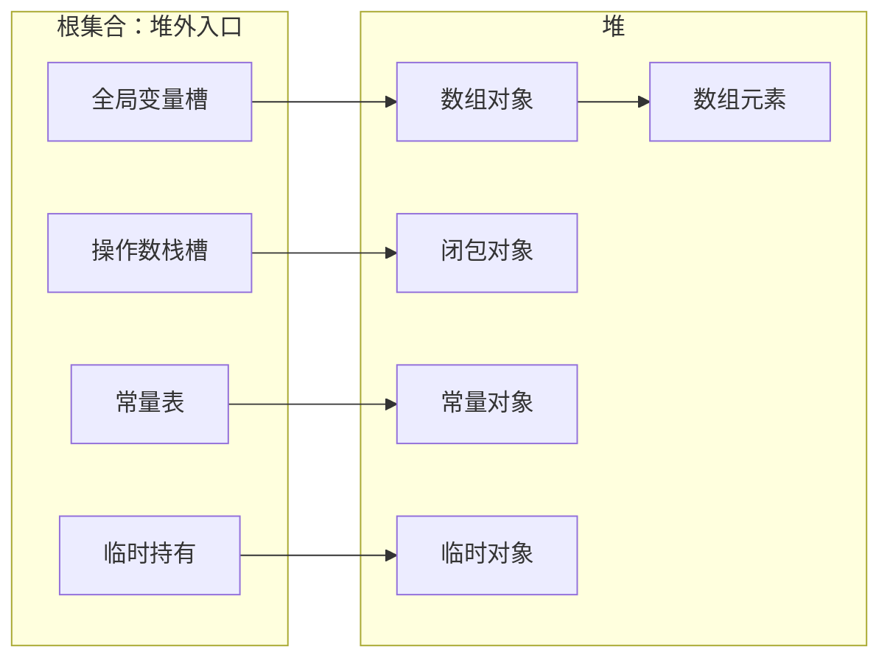
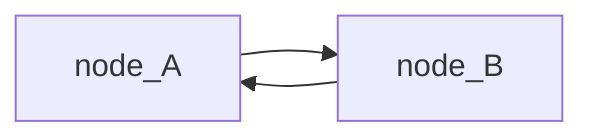
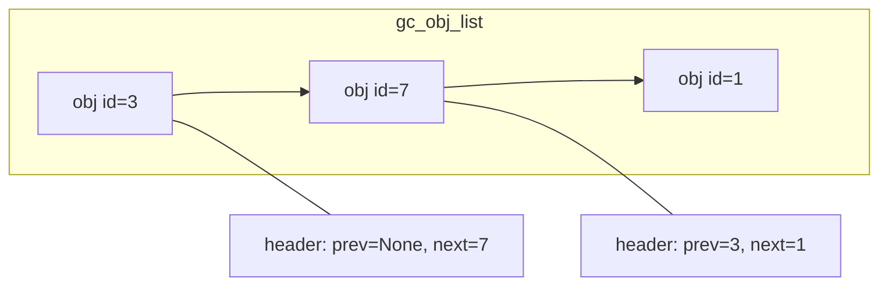
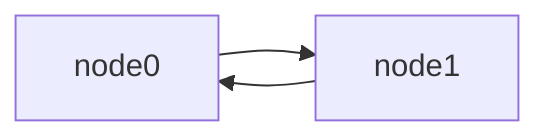
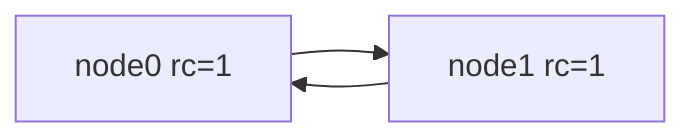
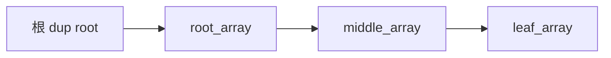
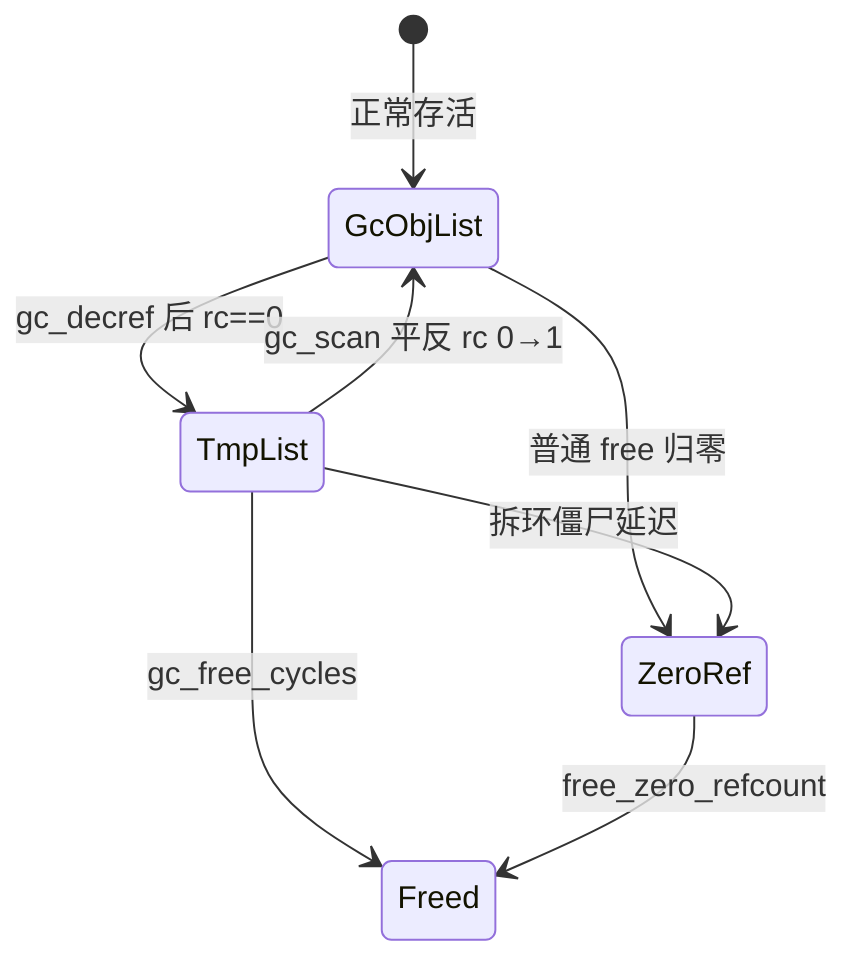
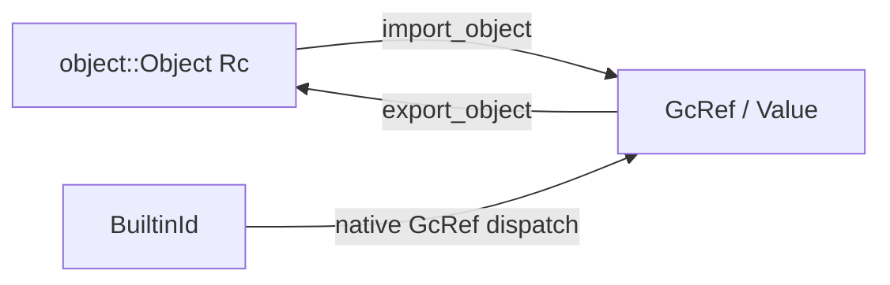
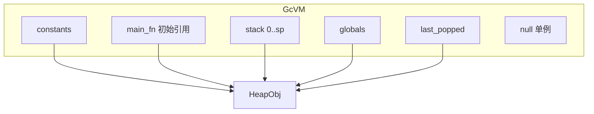

# 给 Monkey VM 加上 GC

## 行文原则

这份报告是一份**概念先行、测试驱动**的实现教程。假设你会 Rust，但没有 GC 背景。读的时候按下面几条预期来：

1. **先讲概念，再写代码。** 每一章开头先用对象图和日常类比把依赖的概念讲清楚，再贴测试、再落到实现。不会在第 6 章才第一次解释"根"是什么。
2. **测试跟着走。** 正文会贴 `gc/` crate 里的真实测试；先看它在钉什么行为，再落到实现。不把测试写成规格书，也不强行套 Given / When / Then。
3. **手工推演。** 复杂算法配 ref_count 逐步变化表或对象图快照，拿纸笔能跟着算——证明"不是碰巧对的"。
4. **语言平实，偶尔口语化。** 读起来像有经验的工程师带你做项目，会有"别问我们怎么知道的""现在还不值得"这类判断和妥协。
5. **聚焦最小可用系统。** 只做到让 `monkey-gc` 跑起来、测得过为止。没做的会在后面坦白。

算法参考 QuickJS（`JS_RunGC`、`gc_decref`、`gc_scan`、`gc_free_cycles`），函数名刻意保持一致，方便对照原版源码。

---

## 0. 导读

### 0.1 这份报告讲什么

我们的 Monkey 字节码 VM 一直用 `Rc<Object>` 管理堆对象。它工作得不错——直到对象图里出现循环。两个对象互相持有，引用计数永远掉不到 0，内存就这么漏了。

这份报告记录我们怎么在 `gc/` crate 里从零搭一套能回收循环的 GC，并把同一套字节码跑在一个新的 `GcVM` 上。

### 0.2 读者假设

- 会 Rust：看得懂 `Vec`、`trait`、借用检查。
- **没有 GC 背景**：不知道 mark-sweep、trial deletion 也没关系。第 1 章只给最小词汇；环怎么收，要等第 5 章亲手撞上泄漏之后再学。
- 愿意跟着测试跑：边读边执行 `cargo test -p monkey-gc` 效果最好。

### 0.3 怎么读

按章节顺序读。每一章只多学一件事，且这件事由上一章的缺口逼出来：先让无环世界跑起来，再撞环，再一步步补上回收算法，最后接到 Monkey 值和 VM。

概念处会尽量配上 Monkey 片段。算法章节仍用测试堆的 `make_cycle` 隔离 collector 本身；完整运行时现在也能通过 class 的可变实例字段，用纯 Monkey 源码构造并回收环。

---

## 1. 概念地基

本章**不写任何项目代码**。只准备后文写堆、写 `dup`/`free` 时会反复用到的几个词。环怎么收、三阶段怎么走——那些要等第 5、6 章，现在提前背没有用。读不懂后面某节时，回来查这一章或文末术语表。

### 1.1 堆、对象、引用、对象图

程序运行时，有些数据活得比单个函数调用更长：数组、闭包、全局变量里的值。这类数据放在**堆**上；栈和寄存器里放的是**引用**——"去堆的第 N 号柜子拿东西"的凭据，不是柜子本身。

用一段 Monkey 把图立起来：

```monkey
let x = [[1]];
```

跑完这行之后，堆和根大致长这样：


- **节点**：堆上的对象（外层数组、内层数组、整数 `1`）。
- **边**：一个对象持有另一个对象的引用（外层的元素是内层数组；内层的元素是 `1`）。
- **引用 / 句柄**：`globals[x]` 里保存的"指向外层数组的凭据"。

后文会把边再拆成两类，现在先立个名：

- **堆内边**：两端都在堆上——A 的字段指着 B。上图里外层 → 内层、内层 → `1` 都是。
- **来自根的边**：一端在堆外——全局槽、栈槽指着某个堆对象。上图里 `globals[x]` → 外层数组就是。

后文里 `GcRef` 就是这种凭据，本质是一个整数下标，不是裸指针。

### 1.2 根（root）

**根**是对象图在堆**外面**的入口：程序还能直接摸到的引用，不经过其他堆对象。

在 Monkey VM 里，根主要包括（精确清单见第 10.1 节）：

| 根来源               | 例子             |
| -------------------- | ---------------- |
| 全局变量槽           | `globals[i]`     |
| 操作数栈槽           | `stack[0..sp)`   |
| 常量表               | 编译期字面量     |
| 调用过程中的临时持有 | `last_popped` 等 |

对照一段真实程序：

```monkey
let xs = [1, 2, 3];
len(xs);
```

- `xs` 进全局槽 → **根**指着数组对象。
- 数组 → `1`、`2`、`3` 这几条是**堆内边**，不是根；这些字面量对象还会额外被 `constants` 持有。
- 调用 `len(xs)` 时，栈上会短暂再持一份数组引用（也是根）；调用结束、栈槽清掉后，只剩全局那份。
- 常量表里的字面量 `1`、`2`、`3` 也是根——编译期就钉在 `constants` 里，整次运行都活着。

测试里的 `TestHeap` 没有真正的 VM，**根**就是测试代码手里的 `GcRef`：你 `alloc()` 拿到的那个句柄，以及你显式 `dup()` 出来的副本。

根的重要性：**只有从根出发沿边能走到的对象才是活的**；走不到的，无论内部结构多复杂，都是垃圾。



### 1.3 可达性与垃圾

**可达**：存在一条从某个根出发、沿有向边行走的路径，能到达该对象。

**垃圾**：堆上还占着槽位，但从**所有**根都不可达。

这是 GC 唯一的判据——不是"有没有被引用"（环里互相引用也算被引用），而是**能不能从程序还活着的入口走到**。

| 情形                         | Monkey 直觉                               | 可达？ | 是垃圾？ |
| ---------------------------- | ----------------------------------------- | ------ | -------- |
| 全局变量指着它               | `let xs = [1];` 里的数组                  | 是     | 否       |
| 只有栈上的临时值指着它       | `len([1, 2, 3])` 调用中的临时数组         | 是     | 否       |
| 两个对象互相指，外部谁都没有 | 环上的节点，全局/栈都已放手               | 否     | **是**   |
| 链式结构，头被 drop 了       | 曾有 `let t = [[1]];`，后来再也摸不到 `t` | 否     | **是**   |

再看一个无环、但有堆内边的例子：

```monkey
let nest = [[1], [2]];
```

- 根：`globals[nest]` → 外层数组。
- 堆内边：外层 → 两个内层数组；每个内层 → 各自的整数。
- 从根出发：外层、两个内层、`1`、`2` **全都可达**，一个都不能收。
- 若程序再也没有 `nest`（测试里相当于 `drop_external_refs`），整棵树从根不可达，应整棵释放——无环时引用计数就能做完，不必跑三阶段 GC。

### 1.4 引用计数：局部视角的近似

**引用计数**给每个堆对象维护一个整数 `ref_count`："当前有多少个持有者指着我"。

- 多一个持有者 → `dup`，计数 +1
- 少一个持有者 → `free`，计数 −1
- 计数归零 → 立刻释放

优点：**无环时**对象在最后一个持有者放手的瞬间就死了，不用等全局 GC，延迟低。

缺点：计数是**局部**信息——对象只知道"有几个人指着我"，不知道"指着我的那些人自己是不是垃圾"。

#### 何时计数 ≡ 可达？

在**无环**对象图上，如果每个 `ref_count` 的 +1 都对应一条真实的边或根持有，且每个 −1 都对应放弃持有，那么：

- `ref_count > 0` ⟺ 至少还有一个根或堆内边指着它 ⟺ 它还活着

这时引用计数 alone 就够用了。第 2–4 章就活在这个世界里。

#### 何时计数 ≠ 可达？

**循环引用**是唯一常见的不等价情形：



外部根已经放手，但 A.rc = 1（来自 B），B.rc = 1（来自 A）。从可达性看两个都是垃圾；从计数看两个都"还有人要"。

Monkey 仍不支持 `a[0] = b` 这种数组原地赋值。下面保留早期设计时使用的数组示意：

```monkey
# 示意：若数组可原地写，就能造环
let a = [null];
let b = [a];
a[0] = b;   # a → b → a
# 之后若再也没有变量指着 a / b，环仍互相撑着，refcount 漏了
```

现在可以用 class 的可变实例字段写出同一张图：

```monkey
class Node {
  connect(other) { this.next = other; }
}

let a = new Node();
let b = new Node();
a.connect(b);
b.connect(a);
```

第 5 章仍先用测试堆的 `make_cycle`，这样失败只归因于 collector；第 10 章再接回完整 Monkey VM。

#### Rc 循环泄漏示例

Rust 标准库的 `Rc` 就是引用计数，循环一样漏：

```rust
use std::cell::RefCell;
use std::rc::Rc;

struct Node {
    next: RefCell<Option<Rc<Node>>>,
}

fn main() {
    let a = Rc::new(Node { next: RefCell::new(None) });
    let b = Rc::new(Node { next: RefCell::new(None) });
    *a.next.borrow_mut() = Some(b.clone());
    *b.next.borrow_mut() = Some(a.clone());
    // 离开作用域前 a、b 的 strong count 都是 2；
    // 局部变量 drop 后各剩 1，仍然不会归零
}
```

我们的 Monkey VM 用 `Rc<Object>` 时，闭包互相捕获、可变数组互相引用，迟早会遇到这张图。第 5 章会在自己的堆里亲手重现它；怎么收，留给第 6 章。

### 1.5 我们选哪条路

业界大致两派：

| 流派                           | 思路                                     | 代表                |
| ------------------------------ | ---------------------------------------- | ------------------- |
| **Tracing**                    | 从根出发标记所有可达对象，没标记的是垃圾 | mark-sweep、分代 GC |
| **Refcount + cycle collector** | 平时靠计数即时释放；定期用额外算法拆掉环 | CPython、QuickJS    |

**Mark-sweep** 干净，但要在 VM 里维护完整的根扫描器，还要处理 STW 或写屏障。

我们选 **QuickJS 路线**：平时仍是引用计数；环由三阶段 trial deletion 回收。选它的理由现在只要记住三条——算法细节等第 6 章撞完红灯再展开：

1. 和现有"每条边手动 dup/free"的纪律兼容，无环路径零 GC 开销。
2. 不必先搭一套完整的根扫描器。
3. QuickJS 已验证工程可行，函数名一一对应，方便对照源码。

### 1.6 后文路线图（概念 → 章节）

| 概念                  | 首次深入 | 测试锚点                                                  |
| --------------------- | -------- | --------------------------------------------------------- |
| `GcRef` 句柄          | 第 2 章  | `refcount_frees_immediately_without_gc`                   |
| dup / free 纪律       | 第 3 章  | `dup_extends_lifetime`                                    |
| trace / 级联释放      | 第 4 章  | `acyclic_holder_extends_child_lifetime`                   |
| 循环泄漏              | 第 5 章  | `collects_simple_cycle`（先红后绿）                       |
| trial deletion 三阶段 | 第 6 章  | `mark_func_decref_zeros_isolated_cycle` 等                |
| 有根的环必须活        | 第 7 章  | `cycle_with_external_root_survives`                       |
| 自动触发              | 第 8 章  | `trigger_gc_on_threshold`                                 |
| Monkey 值 / 桥接      | 第 9 章  | `value_cycle_collected_by_gc`                             |
| VM 根集合             | 第 10 章 | `builtin_call_releases_callee_args_and_stack_temporaries` |

### 1.7 术语表

| 术语                        | 含义                                                                 |
| --------------------------- | -------------------------------------------------------------------- |
| **根（root）**              | 堆外可直接访问的引用：栈槽、全局变量、测试代码手里的 `GcRef` 等      |
| **可达（reachable）**       | 从某个根沿边能走到的对象                                             |
| **堆内边**                  | 两端都在堆上的引用边（数组元素、闭包捕获等）；相对的是「来自根的边」 |
| **引用计数（refcount）**    | 每个对象的持有者数量；`dup` +1，`free` −1                            |
| **外部持有 / 内部持有**     | ref_count 的两半（第 6 章展开）：外部持有来自根；内部持有来自堆内边  |
| **trace**                   | 对象报告自己引用的所有子对象（出边）                                 |
| **trial deletion**          | 三阶段 GC 的第一阶段：试探性减掉所有堆内边（第 6 章）                |
| **mark（header 字段）**     | 阶段内临时标记："我的出边已经减过了"（第 6 章）                      |
| **侵入式链表**              | `list_prev` / `list_next` 嵌在对象 header 里（第 4 章）              |
| **gc_obj_list**             | 存活 GC 对象链表                                                     |
| **tmp_obj_list**            | 阶段 1 后计数归零的**嫌疑人**名单（第 6 章）                         |
| **gc_zero_ref_count_list**  | 延迟释放队列（第 4、6 章）                                           |
| **僵尸（free_mark）**       | 逻辑已死、槽位暂留（第 6 章）                                        |
| **写屏障（write barrier）** | 引用写入时自动维护计数的机制；**我们没做**                           |

---

## 2. 最小的堆：分配和释放

### 2.1 概念：`GcRef` 是堆对象的句柄

`GcRef` 不是对象本体，也不是 `Rc<Object>`。它只是一个不透明的堆内 ID：

```rust
pub struct GcRef(pub GcId);
pub type GcId = usize;
```

运行时用这个 ID 去 `Vec<Option<GcObjectEntry>>` 里查对象。这样 VM、数组、闭包里保存的都是轻量句柄，真正的对象统一由 `GcRuntime` 管。

这个实现是最小版句柄：没有 generation。对象释放后槽位会进入 `free_slots`，以后可能被新对象复用；因此已经 `free` 的那份 `GcRef` 不能再使用。正确性靠 `dup` / `free` 所有权纪律维护，而不是靠句柄本身防 use-after-free。

### 2.2 先看这个测试

```rust
// gc/gc_test.rs
#[test]
fn refcount_frees_immediately_without_gc() {
    let mut heap = TestHeap::new();
    let a = heap.alloc();
    assert!(heap.gc.exists(a));
    heap.gc.free(a);
    assert!(!heap.gc.exists(a));
}
```

空堆上 `alloc` 一个对象，调用者手里的句柄是唯一持有者，`ref_count` 从 1 开始，`exists` 为真。`free` 之后计数归零，槽位立刻归还——无环场景下**不需要**跑 GC。这个测试钉住的最小 API：`alloc` / `free` / `exists`。

释放路径还会跑 finalizer：

```rust
#[test]
fn on_free_called_when_collected() {
    let mut heap = TestHeap::new();
    let a = heap.alloc();
    assert!(!heap.freed.get());
    heap.gc.free(a);
    assert!(heap.freed.get());
    assert!(!heap.gc.exists(a));
}
```

分配统计会被记账（第 8 章触发阈值要用）：

```rust
#[test]
fn malloc_state_tracks_allocations() {
    let mut heap = TestHeap::new();
    let before = heap.gc.malloc_state().malloc_count;
    let a = heap.alloc();
    assert!(heap.gc.malloc_state().malloc_count > before);
    heap.gc.free(a);
}
```

### 2.3 实现

句柄：

```rust
// gc/heap.rs
pub struct GcRef(pub GcId);
pub type GcId = usize;
```

对象表（简化）：

```rust
// gc/runtime.rs
pub struct GcRuntime {
    objects: Vec<Option<GcObjectEntry>>,
    free_slots: Vec<GcId>,
    // ...
}

struct GcObjectEntry {
    header: GcObjectHeader,
    object: Option<Box<dyn GcObject>>,
}
```

header 此刻只需要 `ref_count`：

```rust
// gc/header.rs
pub struct GcObjectHeader {
    pub ref_count: i32,
    // 后面会加 list_prev, mark, free_mark ...
}
```

分配与释放：

```rust
pub fn add_gc_object(&mut self, object: Box<dyn GcObject>, gc_obj_type: GcObjectType) -> GcId {
    let id = self.alloc_slot(GcObjectEntry {
        header: GcObjectHeader::new(gc_obj_type, 1), // 调用者是第一个持有者
        object: Some(object),
    });
    self.list_push_back(GcListKind::GcObj, id);
    id
}

pub fn free_gc(&mut self, id: GcId) {
    // ref_count -= 1；归零则进入级联释放（第 4 章）
}
```

### 2.4 推演验证

`refcount_frees_immediately_without_gc` 的 ref_count 轨迹：

| 步骤 | 操作      | a.ref_count       | exists(a) |
| ---- | --------- | ----------------- | --------- |
| 1    | `alloc()` | 1（测试代码持有） | true      |
| 2    | `free(a)` | 0 → 释放          | false     |

本章钉住了：堆上有对象、有句柄、无环时 `free` 立刻回收。下一章要回答：同一个对象被两处持有时，谁说了算。

---

## 3. 第二个持有者：dup 与所有权纪律

### 3.1 概念：每个 +1 都要能指名道姓

`ref_count` 不是抽象数字——**每一个 +1 都必须对应一个真实持有者**，每一个 −1 都必须对应某个持有者放手。

| 操作       | 谁多了/少了持有                 |
| ---------- | ------------------------------- |
| `alloc()`  | 返回句柄给调用者，计数从 1 开始 |
| `dup(id)`  | 调用者多持有一份，计数 +1       |
| `free(id)` | 调用者少持有一份，计数 −1       |

整个系统只有两条纪律（后文 VM 每条指令都逃不掉）：

- **多一个持有者** → `dup`
- **少一个持有者** → `free`

没有写屏障，没有编译器帮忙，全靠每个调用点自觉。脆，但可测试。

#### 持有者清单示例

对象 `x`，`ref_count = 3` 时，合法的持有者清单长这样：

| 持有者 | 来源                                                      |
| ------ | --------------------------------------------------------- |
| 1      | 测试变量 `let a = heap.alloc()`                           |
| 1      | `let b = heap.dup(a)`                                     |
| 1      | 另一个对象 `holder` 的出边（`link(holder, x)` 时 dup 过） |

若少 `dup` 或多 `free`，计数偏低，可能提前释放；若多 `dup` 或少 `free`，计数偏高，造成泄漏。

### 3.2 这个测试在钉什么

```rust
#[test]
fn dup_extends_lifetime() {
    let mut heap = TestHeap::new();
    let a = heap.alloc();
    let _b = heap.gc.dup(a);   // 第二个持有者（_b 代表"某处多了一份持有"）
    heap.gc.free(a);
    assert!(heap.gc.exists(a));    // 还有人持有，不能死
    heap.gc.free(a);
    assert!(!heap.gc.exists(a));   // 两次 free = 两个持有者都放手了
}
```

先 `alloc`，再 `dup` 多一份持有，第一次 `free` 后对象还必须在——因为还有人要。第二次 `free` 才真正归零。注意：`dup` 返回同一个 `GcId`，不是新对象。QuickJS 里叫 `js_dup` / `JS_FreeValueRT`，我们沿用 `dup` / `free`。

### 3.3 实现

```rust
pub fn dup_gc(&mut self, id: GcId) -> GcId {
    self.header_mut(id).ref_count += 1;
    id
}
```

### 3.4 推演验证

| 步骤 | 操作      | a.ref_count | 持有者                    |
| ---- | --------- | ----------- | ------------------------- |
| 1    | `alloc()` | 1           | 测试代码                  |
| 2    | `dup(a)`  | 2           | 测试代码 + dup 代表的那份 |
| 3    | `free(a)` | 1           | dup 代表的那份            |
| 4    | `free(a)` | 0           | 无 → 释放                 |

#### 持有者清单练手

`holder` 通过 `link(holder, child)` 持 `child` 时：

| 对象   | ref_count | 持有者清单                           |
| ------ | --------- | ------------------------------------ |
| child  | 2         | ① 测试变量 `child` ② `holder` 的出边 |
| holder | 1         | ① 测试变量 `holder`                  |

`free(child)` 后 child.rc = 1，只剩 holder 边——下一章就要处理这种"对象引用对象"的边。

本章钉住了：`dup` / `free` 成对出现，计数才可信。下一章让对象之间也能互相持有。

---

## 4. 对象引用对象：trace 与级联释放

### 4.1 概念：堆不该知道对象内部长什么样

数组的元素、哈希的值、闭包的捕获——每种对象内部布局不同。如果 `GcRuntime::free` 里写满 `match` 分支去翻字段，每加一种 Monkey 类型都要改运行时。

**控制反转**：对象自己通过 `trace` 报告出边；堆只负责沿边 `dup`/`free` 和 GC 遍历。这是全文最重要的 trait 约定。

#### 无环世界的承诺

只要图无环，最后一个根或堆边放手后，整条子树会通过级联 `free` 在**一次 GC 都不跑**的情况下清空。第 5 章之前的世界完全靠引用计数。

#### 深链与栈溢出

若 `free` 归零时**同步递归**释放子节点，一万层链表会把 Rust 调用栈撑爆：

```text
free(链头) → free(子) → free(孙) → ... 深度 = 链长
```

解法：归零对象先挂到 `gc_zero_ref_count_list`，`free_zero_refcount` 用 `while` 循环平铺消化——深度从 O(链长) 变成 O(1) 调用栈。

#### 侵入式链表

GC 运行时不应再分配 `Vec` 或链表节点。`list_prev` / `list_next` 直接住在 header 里——QuickJS `list.h` 同款。



### 4.2 测试脚手架：TestHeap 与 TestNode

正文测试不是直接操作裸 `GcRuntime`，而是包了一层 `TestHeap`。读 `gc/gc_test.rs` 时值得先看懂它：

```rust
struct TestNode {
    id: Rc<Cell<Option<usize>>>,           // 自己的 GcId，trace 时查边表
    edges: EdgeMap,                        // Rc<RefCell<HashMap<GcId, Vec<GcRef>>>>
    freed: Rc<Cell<bool>>,                 // on_free 有没有被调用
    freed_ref_counts: Rc<RefCell<HashMap<usize, i32>>>,
}

impl GcObject for TestNode {
    fn trace(&self, visit: &mut dyn FnMut(GcId)) {
        // 从 edges[id] 取出子节点，逐个 visit
    }
}
```

| 方法                         | 行为                                     |
| ---------------------------- | ---------------------------------------- |
| `alloc()`                    | 分配 `TestNode`，在 `edges` 里建空邻接表 |
| `link(from, to)`             | `dup(to)` + 在 `edges[from]` 里加一条边  |
| `make_cycle(n)`              | n 个节点首尾相连（第 5 章）              |
| `drop_external_refs(&[ids])` | 对测试手里的每个句柄 `free` 一次         |

**边在测试自己的 `EdgeMap` 里，不在 `GcRuntime` 里**——这样我们能随意搭图，不必等 Monkey `Value` 写好。

### 4.3 父活着，子不能死

```rust
#[test]
fn acyclic_holder_extends_child_lifetime() {
    let mut heap = TestHeap::new();
    let child = heap.alloc();
    let holder = heap.alloc();
    heap.link(holder, child);      // holder 持有 child（内部 dup 了 child）

    heap.gc.free(child);           // 测试代码放弃对 child 的直接引用
    assert!(heap.gc.exists(child)); // holder 的边还在

    heap.gc.free(holder);
    assert!(!heap.gc.exists(child)); // 级联释放
}
```

`link` 之后 child 有两份持有：测试变量和 holder 的边。测试 `free(child)` 只放弃自己那份，holder 还在，child 必须活着。`free(holder)` 时 holder 归零，`trace` 沿边再 `free` child，整条链清空。

整棵无环树外部引用全 drop 后，也不用 `run_gc`：

```rust
#[test]
fn acyclic_graph_freed_without_gc() {
    let mut heap = TestHeap::new();
    let c = heap.alloc();
    let b = heap.alloc();
    heap.link(b, c);
    let a = heap.alloc();
    heap.link(a, b);

    heap.drop_external_refs(&[a, b, c]);
    assert!(!heap.gc.exists(a));
    assert!(!heap.gc.exists(b));
    assert!(!heap.gc.exists(c));
}
```

对象图：


### 4.4 实现

```rust
pub trait GcObject: Any {
    fn trace(&self, visit: &mut dyn FnMut(GcId));
    fn on_free(&mut self, _rt: &mut GcRuntime) {}
}
```

释放路径（简化）：

```rust
fn free_heap_object(&mut self, id: GcId) {
    self.header_mut(id).free_mark = true;
    let mut object = /* take from slot */;
    object.trace(&mut |child| self.free_gc(child));
    object.on_free(self);
    drop(object);
    // 归零则 free_slot；RemoveCycles 阶段可能延迟（第 6 章）
}

fn free_zero_refcount(&mut self) {
    self.gc_phase = GcPhase::Decref;
    while let Some(id) = self.gc_zero_ref_count_list.head {
        self.free_gc_object(id);
    }
    self.gc_phase = GcPhase::None;
}
```

`gc_phase` 此刻像多余牌子，第 6 章拆环时会救命。

### 4.5 推演验证：`acyclic_holder_extends_child_lifetime`

| 步骤 | 操作                  | child.rc | holder.rc | 说明                                  |
| ---- | --------------------- | -------- | --------- | ------------------------------------- |
| 1    | `alloc` child         | 1        | —         | 测试持有 child                        |
| 2    | `alloc` holder        | —        | 1         | 测试持有 holder                       |
| 3    | `link(holder, child)` | 2        | 1         | holder 边 dup child                   |
| 4    | `free(child)`         | 1        | 1         | 测试放手，holder 还在                 |
| 5    | `free(holder)`        | 0        | 0         | holder 死 → trace → free child → 子死 |

无环世界到这里能跑通了：句柄、dup/free、trace、级联释放。下一章把两个节点首尾相连——引用计数会当场露馅。

---

## 5. 红灯：循环引用

### 5.1 概念：引用计数的天花板

第 1 章说过：环上每个对象的计数都 ≥ 1（来自环内邻居），但外部根已经没了——**可达性说它们是垃圾，计数说它们还活着**。

要判断"持有者是不是垃圾"，必须有人看**全局**对象图。这就是为什么要写 `run_gc`。

无环时 Monkey 自己就能演示「放手即死」：

```monkey
let t = [[1], [2]];
# 若之后再也摸不到 t，整棵嵌套数组应被 refcount 级联清掉，不必 run_gc
```

环则不行。第 5 章用测试堆的 `make_cycle` 搭出等价对象图，把语言前端和 VM 排除在算法测试之外；完整 VM 测试还会用两个 `Node` instance 的字段互指来覆盖真实源码路径。

### 5.2 先写一个会红的测试

```rust
fn make_cycle(&mut self, size: usize) -> Vec<GcRef> {
    let nodes: Vec<GcRef> = (0..size).map(|_| self.alloc()).collect();
    for i in 0..size {
        self.link(nodes[i], nodes[(i + 1) % size]);
    }
    nodes
}

#[test]
fn collects_simple_cycle() {
    let mut heap = TestHeap::new();
    let nodes = heap.make_cycle(2);
    heap.drop_external_refs(&nodes);

    heap.gc.run_gc();
    assert!(!heap.gc.exists(nodes[0]));
    assert!(!heap.gc.exists(nodes[1]));
}
```

两节点环，测试手里各有一份外部 ref；`drop_external_refs` 把外部根全部放手，再 `run_gc()`。此时还没有实现会失败——故意写的红灯。绿了之后，两个节点都应不存在。

两节点环对象图：



### 5.3 推演：没有 GC 时会发生什么

| 步骤 | 操作                     | node0.rc | node1.rc | 备注             |
| ---- | ------------------------ | -------- | -------- | ---------------- |
| 1    | 各 `alloc`               | 1        | 1        | 外部各 1         |
| 2    | `link(0→1)`, `link(1→0)` | 2        | 2        | 各多环内 1       |
| 3    | `drop_external_refs`     | 1        | 1        | 只剩环内边       |
| 4    | 尝试 `free`              | 不变     | 不变     | rc > 0，无法释放 |

**泄漏确认**：两个对象永远挂在 `gc_obj_list` 里。这就是 `Rc` 的洞，现在在我们自己的堆里重现了。

### 5.4 缺口：我们缺一次全局观察

局部的 `dup`/`free` 救不了环——每个节点都觉得"还有人要我"。下一章要引入一个观察：

```text
ref_count = 外部持有数 + 内部持有数
```

用第 1 章的嵌套数组对照一下（先只看数组对象，整数是否还被常量表指着不影响这里的拆分）：

```monkey
let nest = [[1]];
```

| 对象     | 外部持有（根）  | 内部持有（堆内边） | ref_count 里混着什么 |
| -------- | --------------- | ------------------ | -------------------- |
| 外层数组 | `globals[nest]` | 无                 | 纯外部 = 1           |
| 内层数组 | 无              | 外层 → 内层        | 纯内部 = 1           |

环泄漏时，两个节点的「外部」都是 0，「内部」各是 1——混在一个数字里就看不出来。我们不扫根去数外部持有，而是**试探性地把内部边从计数里减掉**，看谁剩 0。怎么减、减完为什么还不能立刻释放、误伤怎么办——一步步来，都在第 6 章。

---

## 6. 三阶段回收：先破坏，再修复，再释放

第 5 章的红灯还亮着。本章从那个泄漏表出发，先弄清一个等式，再只做阶段 1；撞上嵌套误伤之后再补阶段 2；最后才真正释放。

### 6.0 核心观察：把内部持有减掉

Bob Nystrom 在 [Baby's First Garbage Collector](https://journal.stuffwithstuff.com/2013/12/08/babys-first-garbage-collector/) 里把 mark-sweep 说成一句几乎无聊的话：

> 从还在作用域里的变量出发，沿对象字段走；走得到的是活的，走不到的就是垃圾。

trial deletion 的洞见是同一判据的**反面走法**：

> 把堆内的边都假装不算数。每个对象计数里剩下的，就是还有几个根在要它。剩 0 的——再确认没有活人能走到——才是垃圾。

mark-sweep 问的是「从外面能摸到谁」；trial deletion 问的是「若只认根、不认堆内互指，谁还站得住」。两者回答同一个问题，只是一个顺着图走，一个从计数里把图减掉。

每个对象的 `ref_count` 可以按来源拆成两半：

```text
ref_count = 外部持有数 + 内部持有数
```

- **外部持有数**：来自根——栈槽、全局变量、测试代码手里的 `GcRef`。它是可达性传播的入口。
- **内部持有数**：来自其他堆对象的边——数组元素、闭包捕获。单独不能证明对象活着。

对照 Monkey：

```monkey
let xs = [1, 2];
```

| 谁指着谁                  | 算哪一半                                   |
| ------------------------- | ------------------------------------------ |
| `globals[xs]` → 数组      | **外部**（根）                             |
| 数组 → `1`、数组 → `2`    | **内部**（堆内边）                         |
| 常量表里的字面量 `1`、`2` | 也是根；整数对象可能同时被常量表和数组指着 |

第 5 章的环泄漏，本质就是这两半混在一起算：环内边把计数撑在 1，盖住了"外部已经没人要"的事实。

GC 真正想知道的是外部持有数。直觉做法是枚举所有根、再 DFS——那正是 mark-sweep。trial deletion 走反方向：**不数外部持有，而是把内部持有从计数里减掉，剩下的自然就是外部持有数。**

能这样做，是因为内部持有有对称结构：

> 每个对象的"内部持有数" = 指向它的堆内**入边**数。
> 每条入边，一定是某个对象的**出边**。

所以只要**遍历每个对象、沿它的出边把邻居的计数 −1**，就等价于把每个对象的入边都减了一遍：

```text
对每个对象 X，沿出边 decref 邻居
   = 对每条堆内边 (X → Y)，做 Y.ref_count −= 1
遍历完所有 X  ⟹  剩余 ref_count = 原本的外部持有数
```

用第 5 章那张纯 2 环、无根的图验一遍：



| 对象  | 初始 rc | 堆内入边 | 减完后 rc |
| ----- | ------- | -------- | --------- |
| node0 | 1       | 1        | 0         |
| node1 | 1       | 1        | 0         |

两边都归零——和"外部持有 = 0"一致。但归零的只是**嫌疑人**，不是立刻释放：有些对象没有外部持有，却能从有外部持有的对象沿边走到；减边时它们也会暂时变成 0。所以删除必须是**可逆**的——这就是 "trial"（试探）的意思。后面会看到怎么平反。

运行时用两张侵入式链表搬对象（第 4 章的 `list_prev` / `list_next`）：

| 名单           | 含义                                            |
| -------------- | ----------------------------------------------- |
| `gc_obj_list`  | **未受怀疑**的存活对象；GC 开始前所有对象都在这 |
| `tmp_obj_list` | **嫌疑人**：减完边后计数归零、但尚未定罪        |


先把阶段 1 做对。

### 6.1 阶段 1：gc_decref

单独测阶段 1：外部根已 drop 的纯环，减完堆内边后两个节点都应归零。

```rust
#[test]
fn mark_func_decref_zeros_isolated_cycle() {
    let mut heap = TestHeap::new();
    let nodes = heap.make_cycle(2);
    heap.drop_external_refs(&nodes);

    for &id in &nodes {
        heap.gc.mark_children(id, MarkFunc::Decref);
        heap.gc.header_mut(id).mark = 1;
    }

    assert_eq!(heap.gc.ref_count(nodes[0]), 0);
    assert_eq!(heap.gc.ref_count(nodes[1]), 0);
}
```

#### 实现要点

```rust
fn gc_decref(&mut self) {
    let mut current = self.gc_obj_list.head;
    while let Some(id) = current {
        let next = self.header(id).list_next;
        self.mark_children(id, MarkFunc::Decref);
        self.header_mut(id).mark = 1;
        if self.header(id).ref_count == 0 {
            self.list_move(GcListKind::GcObj, GcListKind::Tmp, id);
        }
        current = next;
    }
}

fn gc_decref_child(&mut self, id: GcId) {
    self.header_mut(id).ref_count -= 1;
    if self.header(id).ref_count == 0 && self.header(id).mark == 1 {
        self.list_move(GcListKind::GcObj, GcListKind::Tmp, id);
    }
}
```

#### `mark` 字段：守住"出边减完才进名单"这条不变量

阶段 1 的主循环只走 `gc_obj_list`。一旦某个对象被搬进 `tmp_obj_list`，主循环就再也碰不到它——可它的出边可能还没 decref 过。

所以有一条必须守的不变量：

> **对象必须在"自己的出边全部减完"之后，才能进 `tmp_obj_list`。** 否则它的出边永远漏减，邻居计数偏高，环可能漏回收。

`mark` 就是守这条不变量的标志位：

- `mark = 0`：出边还没处理。
- `mark = 1`：`mark_children` 跑过了，出边已全部 decref。

看 `gc_decref` 的顺序：先 `mark_children(id, Decref)`，**再** `header.mark = 1`。再看 `gc_decref_child`：子对象归零时，**只有它 `mark == 1` 才立刻进 tmp**；否则留在 `gc_obj_list`，等主循环轮到它、把出边减完再判定。

| 失败模式 | 原因             | 后果                            |
| -------- | ---------------- | ------------------------------- |
| 少减     | 某条堆内边没减掉 | 垃圾对象 rc 仍 > 0，漏回收      |
| 多减     | 同一条边减了两次 | 活人 rc 变 0 进 tmp，可能被误杀 |

**反例：不守不变量会怎样**

两节点环，处理顺序若让 node1 先被邻居减量、自己出边尚未处理：

```text
node1 被 node0 的边减量 → rc 0，但 mark 仍为 0
若此时立刻进 tmp 且不再处理 node1 的出边 → node0 少减一条 → 泄漏
```

`mark == 1` 这道闸拦住了这个时序。

**反例：若边减两次**

同一子节点被两个父节点各减一次本没问题（两条不同的入边）；但若**同一条边**因重复 `mark_children` 减两次，活人 rc 会偏低甚至变 0。所以每个对象在阶段 1 恰好被 `mark_children` 一次。

进 `tmp_obj_list` **不是释放**，只是嫌疑人名单。

#### 推演：两节点孤立环

| 步骤                  | node0.rc | node1.rc | 名单                                             |
| --------------------- | -------- | -------- | ------------------------------------------------ |
| 初始                  | 1        | 1        | 空                                               |
| 处理 node0，边 →node1 | 1        | 0        | node1 尚未处理出边，`mark=0`，仍在 `gc_obj_list` |
| 处理 node1，边 →node0 | 0        | 0        | node0 已 `mark=1`，先进入 tmp                    |
| node1 标记完成        | 0        | 0        | node1 也进入 tmp                                 |

阶段 1 结束性质：**剩余 rc = 根引用数**（此例根为 0）。孤立环到这里计数对了——但还没真正释放，也还没处理下一节的误伤。

### 6.2 嵌套链为什么会被误杀

阶段 1 alone 不够。看这张图——根只持着头，middle 和 leaf 全靠堆内边：



对应 Monkey（合法、今天就能跑）：

```monkey
let root = [[[1, 2], 3], 4];
# 结构：root → middle → leaf → …
# 只有 globals[root] 是外部持有；middle / leaf 全靠堆内边活着
```

| 对象   | 初始 rc | 堆内入边 | 阶段 1 后 rc |
| ------ | ------- | -------- | ------------ |
| root   | 1       | 0        | 1（根持有）  |
| middle | 1       | 1        | 0（误伤）    |
| leaf   | 1       | 1        | 0（误伤）    |

middle、leaf 从 root 可达，是活的；但它们的计数全来自堆内边，减完变 0，进了嫌疑人名单。阶段 1 只看"减完边后还有没有剩余"，看不到"能不能从活人走过去"。

**没有下一阶段的平反，嵌套结构的中层会被误杀。** 这就是阶段 2 的动机。

换句话说：你写 `let root = [[[1]]];` 这种很普通的嵌套，阶段 1 也会把内层数组暂时减成 0——所以 trial deletion **必须**可逆，不能减完就释放。

### 6.3 阶段 2：gc_scan

阶段 2 从 **rc > 0 且仍在 `gc_obj_list` 的对象** 出发，沿边把计数加回去；从 0 变 1 的嫌疑人从 `tmp` 移回 `gc_obj_list` **尾部**。

#### 动态遍历 ≠ 快照

循环沿 `list_next` **动态**往后走。刚被平反的对象追加在尾部，同一轮稍后会被扫到——**链式营救**。

**反例推演：快照成 Vec 会漏杀**

对象图：`root → A → B → C`，阶段 1 后仅 root 存活，A/B/C 全在 tmp。

| 时刻        | 正确做法（动态 list_next） | 错误做法（开头快照 ids = [root]） |
| ----------- | -------------------------- | --------------------------------- |
| 扫描开始    | current = root             | 只遍历 [root]                     |
| root 平反 A | A 移到 gc_obj_list 尾部    | A 回到活人堆，但 ids 里没有 A     |
| 继续        | current 走到 A，平反 B     | 循环已结束                        |
| 再继续      | A 平反 B，B 平反 C         | B、C 永远留在 tmp                 |
| 阶段 3      | tmp 空                     | **误杀 B、C**                     |

QuickJS 用 `list_for_each` 达到动态效果；我们 `while let Some(id) = current { current = header(id).list_next }` 同理。别问我们怎么知道的。

#### `ScanIncref2`：为啥给死人恢复计数？

第二遍对 `tmp_obj_list` **剩下来的**对象做 `ScanIncref2`，只 +1，不迁链表。

**反例：若跳过第二遍**

2 环 A ↔ B，阶段 2 后 A、B 仍在 tmp，各自 rc 在阶段 1 末为 0，第二遍各 +1 → 都变 1。

阶段 3 释放 A：沿边 `free(B)` → B: 1→0；A 本体 drop 后 A.rc 可能仍为 1（B 指着僵尸 A）。

若阶段 2 没把环内 rc 恢复到"满边状态"，释放时沿边多次 `free_gc` 会把计数减成**负数**，`ref_count > 0` 的判断失效，拆环节奏全乱。

**先恢复环内计数，再有序拆除，每一步的数才对。**

#### 实现（简化）

```rust
fn gc_scan(&mut self) {
    let mut current = self.gc_obj_list.head;
    while let Some(id) = current {
        self.header_mut(id).mark = 0;
        self.mark_children(id, MarkFunc::ScanIncref);
        current = self.header(id).list_next;
    }
    let mut current = self.tmp_obj_list.head;
    while let Some(id) = current {
        let next = self.header(id).list_next;
        self.mark_children(id, MarkFunc::ScanIncref2);
        current = next;
    }
}
```

#### 推演：嵌套数组误伤与营救

假设只有 `globals[root]` 持 `root_array`，结构 `root → middle → leaf`。

| 阶段                             | root.rc | middle.rc | leaf.rc |
| -------------------------------- | ------- | --------- | ------- |
| GC 前                            | 1       | 1         | 1       |
| 阶段 1 后                        | 1       | 0         | 0       |
| 扫描 root，+middle               | 1       | 1         | 0       |
| 扫描 middle（从尾部捞回），+leaf | 1       | 1         | 1       |

活人救回来了。`tmp` 上剩下的，才是真垃圾——交给阶段 3。

### 6.4 阶段 3：gc_free_cycles

#### 僵尸槽（free_mark）

A、B 互指。先释放 A：沿边 `free(B)`，跑 `on_free`，drop A 本体——但 B 仍指着 A，A.rc 可能还是 1。若此时归还 A 的槽位，稍后 `free(B)` 沿边碰 A 会炸。

**僵尸**：`free_mark = true`，逻辑已死，槽位推迟到 `gc_zero_ref_count_list` 统一归还。

#### 实现（简化）

```rust
fn gc_free_cycles(&mut self) {
    self.gc_phase = GcPhase::RemoveCycles;
    while let Some(id) = self.tmp_obj_list.head {
        self.free_gc_object(id);
    }
    self.gc_phase = GcPhase::None;
    // 归还 zero_ref 里的僵尸槽
}
```

`RemoveCycles` 期间 `free_gc` 只减计数，不触发普通级联节奏。

#### 推演：A、B 互指环拆尸

| 步骤 | 操作        | A.rc | B.rc | A 槽 | B 槽   |
| ---- | ----------- | ---- | ---- | ---- | ------ |
| 0    | 阶段 3 入口 | 1    | 1    | 活   | 活     |
| 1    | free A      | 1    | 0    | 僵尸 | 活     |
| 2    | free B      | 0    | 0    | 僵尸 | 已归还 |
| 3    | 收尾        | —    | —    | 归还 | —      |

#### 环的变体

自环、三节点、四节点、重复跑 GC，以及 finalizer 时序：

```rust
#[test]
fn self_cycle_collected() {
    let mut heap = TestHeap::new();
    let a = heap.alloc();
    heap.link(a, a);
    heap.gc.free(a);
    heap.gc.run_gc();
    assert!(!heap.gc.exists(a));
}

#[test]
fn three_node_cycle_collected() {
    let mut heap = TestHeap::new();
    let nodes = heap.make_cycle(3);
    heap.drop_external_refs(&nodes);
    heap.gc.run_gc();
    for &id in &nodes {
        assert!(!heap.gc.exists(id));
    }
}

#[test]
fn four_node_cycle_collected() {
    let mut heap = TestHeap::new();
    let nodes = heap.make_cycle(4);
    heap.drop_external_refs(&nodes);
    heap.gc.run_gc();
    for &id in &nodes {
        assert!(!heap.gc.exists(id));
    }
}

#[test]
fn repeated_gc_is_idempotent() {
    let mut heap = TestHeap::new();
    let nodes = heap.make_cycle(2);
    heap.drop_external_refs(&nodes);
    heap.gc.run_gc();
    heap.gc.run_gc();
    assert!(!heap.gc.exists(nodes[0]));
    assert!(!heap.gc.exists(nodes[1]));
}

#[test]
fn self_cycle_finalizer_runs_after_edges_are_released() {
    let mut heap = TestHeap::new();
    let a = heap.alloc();
    heap.link(a, a);
    heap.gc.free(a);
    heap.gc.run_gc();
    assert_eq!(heap.freed_ref_counts.borrow().get(&a.0).copied(), Some(0));
    assert!(!heap.gc.exists(a));
}
```

`self_cycle_finalizer_runs_after_edges_are_released` 钉住：**`on_free` 跑时环内边已释放，计数为 0**。

#### 三阶段全景：链表迁移



### 6.5 收束：`run_gc` 与下一章预告

三阶段合在一起，就是：

```rust
pub fn run_gc(&mut self) {
    self.gc_decref();       // 阶段 1：试探性减掉堆内边
    self.gc_scan();         // 阶段 2：活对象平反误伤者
    self.gc_free_cycles();  // 阶段 3：名单上剩的才是真垃圾
}
```

阶段 1 只看"减完边后还有没有剩余"；阶段 2 补上"能不能从活人走过去"。两者合起来，才等价于第 1.3 节的可达性判据。

还有一种图本章没细测：环上一点有根。


阶段 1 后 node0 剩 1（根那份），node1 进 tmp；阶段 2 从 node0 救回。**循环 ≠ 垃圾**——下一章专门钉住这件事。

第 5 章的 `collects_simple_cycle` 到这里可以绿了。

---

## 7. 活着的环：循环 ≠ 垃圾

### 7.1 概念

回收判据是**不可达**，不是**成环**。只要外面还有人抓着环上任意节点，整个环都必须活。

对照第 6.2 的嵌套：`let root = [[[1]]];` 里 middle 成不了环，但「有人从外面抓着」同一条规则——`globals[root]` 在，整条链都活。环只是多了「互相指」而已：

```monkey
# 示意：环上一点仍被全局抓着
let a = [null];
let b = [a];
a[0] = b;
# 此时 globals[a]、globals[b] 都还在 → 整环必须活
# 若只放开 b、仍留着 a，整环也必须活
```

下一节用测试堆精确钉住这两种情况。

### 7.2 外面还有人抓着

```rust
#[test]
fn cycle_with_external_root_survives() {
    let mut heap = TestHeap::new();
    let nodes = heap.make_cycle(2);

    let root = heap.gc.dup(nodes[0]);
    heap.gc.run_gc();

    assert!(heap.gc.exists(nodes[0]));
    assert!(heap.gc.exists(nodes[1]));

    heap.gc.free(root);
    heap.drop_external_refs(&nodes);
    heap.gc.run_gc();
    assert!(!heap.gc.exists(nodes[0]));
    assert!(!heap.gc.exists(nodes[1]));
}
```

先 `dup` 一份外部根挂在环上，跑 GC——环必须还在。放开根、再 drop 测试手里的句柄、再 GC——环才该消失。

救人者不必是"根"，只要是**活对象**：

```rust
#[test]
fn external_ref_to_cycle_entry_survives_gc() {
    let mut heap = TestHeap::new();
    let nodes = heap.make_cycle(2);
    let holder = heap.alloc();
    heap.link(holder, nodes[0]);

    heap.gc.free(nodes[0]);
    heap.gc.free(nodes[1]);

    heap.gc.run_gc();
    assert!(heap.gc.exists(nodes[0]));
    assert!(heap.gc.exists(nodes[1]));
    assert!(heap.gc.exists(holder));

    heap.gc.free(holder);
    heap.gc.run_gc();
    assert!(!heap.gc.exists(nodes[0]));
    assert!(!heap.gc.exists(nodes[1]));
}
```

`holder` 在 `gc_obj_list` 里活着，阶段 2 从它出发能把环整条救回来。

### 7.3 推演验证：带外部根的 2 环

第一次 GC 前，测试里的 `nodes[0]` / `nodes[1]` 句柄还没释放，另外又 `dup` 了一份 `root`。所以不是"只有一个外部根"：

- `node0.rc = 3`：`nodes[0]` + `root` + `node1 → node0`
- `node1.rc = 2`：`nodes[1]` + `node0 → node1`

| 阶段 | 操作                     | node0.rc | node1.rc | gc_obj_list | tmp |
| ---- | ------------------------ | -------- | -------- | ----------- | --- |
| 0    | GC 前                    | 3        | 2        | 0,1         | 空  |
| 1a   | 处理 node0，decref node1 | 3        | 1        | 0,1         | 空  |
| 1b   | 处理 node1，decref node0 | 2        | 1        | 0,1         | 空  |
| 2a   | scan node0，incref node1 | 2        | 2        | 0,1         | 空  |
| 2b   | scan node1，incref node0 | 3        | 2        | 0,1         | 空  |
| 3    | tmp 空                   | 3        | 2        | 0,1         | 空  |

`root` 被 `free`，再 `drop_external_refs(&nodes)` 后，两节点各只剩一条环内边，变成第 5 章的纯环，下一次 GC 回收。

### 7.4 推演验证：`external_ref_to_cycle_entry_survives_gc`

对象图：`holder → node0 ↔ node1`，测试已 `free` 对 node0/node1 的直接引用。

| 对象   | GC 前 rc | 外部根？                                     |
| ------ | -------- | -------------------------------------------- |
| holder | 1        | 是，测试代码仍持有着（未 free）              |
| node0  | 2        | 否，来自 `holder → node0` 和 `node1 → node0` |
| node1  | 1        | 否，来自 `node0 → node1`                     |

阶段 1 后 `holder.rc = 1`（测试代码持有），`node0` / `node1` 会进入 tmp；阶段 2 从 holder 出发先平反 node0，再动态扫到 node0 平反 node1，整环回到 `gc_obj_list`。`free(holder)` 后再 GC，环变不可达，收掉。

环能收、活环能留。下一章回答：什么时候自动跑 `run_gc`。

---

## 8. 什么时候跑 GC

### 8.1 概念：不能每次分配都全堆扫

三阶段 GC 的成本与**当前堆对象数量**成正比：阶段 1 扫 `gc_obj_list` 每条边 trial decref；阶段 2 再扫一遍；阶段 3 处理 tmp。若每次 `alloc` 都 `run_gc()`，程序退化成 O(分配次数 × 堆大小)。

无环垃圾已被引用计数**即时**收掉——临时数组、函数返回的中间值在最后一个 `free` 时就死了，根本进不了"需要环检测"的路径。因此：

| 堆行为                         | GC 频率      |
| ------------------------------ | ------------ |
| 稳定，只有无环分配/释放        | 几乎不触发   |
| 猛涨（大量新对象、可能出现环） | 超过阈值才扫 |

**1.5 倍系数**：触发后 `threshold = malloc_size + malloc_size/2`。堆从 100KB 涨到触发点，下次要涨到 150KB 才再触发——避免抖动。注意阈值只在 `trigger_gc()` 实际触发 GC 后重算；普通释放会降低 `malloc_size`，但不会立刻降低 `malloc_gc_threshold`。

`MallocState` 在 `alloc_slot` / `free_slot` 记账；`trigger_gc(alloc_size)` 在**即将分配**前判断 `malloc_size + alloc_size > threshold`。

#### 纯 refcount 路径（预留）

不参与环检测的值（未来大字符串等）可走 `RefCountHeader`：

```rust
#[test]
fn ref_counted_freed_without_gc() {
    let mut gc = GcHeap::new();
    let freed = Rc::new(Cell::new(false));
    let id = gc.runtime_mut().add_ref_counted(/* on_free */);
    let dup = gc.runtime_mut().dup_ref_counted(id);
    gc.runtime_mut().free_ref_counted(id);
    assert!(!freed.get());
    gc.runtime_mut().free_ref_counted(dup);
    assert!(freed.get());
}
```

API 已留好；当前 `Value::String` 仍内联在 `ValueCell`，见第 11 章。

### 8.2 阈值一到就该扫

```rust
#[test]
fn trigger_gc_on_threshold() {
    let mut heap = TestHeap::new();
    heap.gc.set_gc_threshold(0);

    let nodes = heap.make_cycle(2);
    heap.drop_external_refs(&nodes);

    heap.gc.trigger_gc(1);
    assert!(!heap.gc.exists(nodes[0]));
    assert!(!heap.gc.exists(nodes[1]));
}
```

阈值设成 0，下一次 `trigger_gc` 必跑 `run_gc`，环应被收掉。

### 8.3 实现

```rust
pub fn trigger_gc(&mut self, alloc_size: usize) {
    let force_gc =
        self.malloc_state.malloc_size.saturating_add(alloc_size) > self.malloc_gc_threshold;
    if force_gc {
        self.run_gc();
        self.malloc_gc_threshold =
            self.malloc_state.malloc_size + (self.malloc_state.malloc_size >> 1);
    }
}
```

堆和环收集到这里能独立工作了。下一章把 Monkey 的值搬进这套堆。

---

## 9. 把 Monkey 的值搬进堆

### 9.1 概念：哪些 Monkey 值有出边？

| Value 变体                                      | 堆内出边                  |
| ----------------------------------------------- | ------------------------- |
| `Integer`, `Boolean`, `String`, `Null`, `Error` | 无                        |
| `Array`                                         | 每个元素                  |
| `Hash`                                          | 每个值                    |
| `Closure`                                       | `func` + 每个 `free` 捕获 |
| `CompiledFunction`                              | 无（字节码元数据）        |
| `Builtin`                                       | 无                        |

`object::Object` 内部是 `Rc<Object>`，塞不进我们的堆。在 `gc/value.rs` 做镜像，边全换成 `GcRef`。

### 9.2 所有权、import、环

`alloc_value` 给数组装子元素时，子节点的计数要 +1；父被 `free` 后子还在（调用者手里还有句柄）：

```rust
#[test]
fn alloc_value_increments_child_refcounts() {
    let mut heap = GcHeap::new();
    let child = alloc_value(&mut heap, Value::Integer(1));
    assert_eq!(heap.ref_count(child), 1);

    let parent = alloc_value(&mut heap, Value::Array(vec![child]));
    assert_eq!(heap.ref_count(child), 2);

    heap.free(parent);
    assert_eq!(heap.ref_count(child), 1);
}
```

`alloc_value` **不**接管调用者手里的引用——传进去的 `child` 仍归调用者 `free`。

import 深拷贝时，子节点会先作为临时 `GcRef` 握在调用栈上，父对象 `alloc` 完成后这些临时持有必须释放：

```rust
#[test]
fn import_object_releases_temporary_child_refs() {
    let mut heap = GcHeap::new();
    let original = Object::Array(vec![Rc::new(Object::Array(vec![
        Rc::new(Object::Integer(1)),
        Rc::new(Object::Integer(2)),
    ]))]);

    let root = import_object(&mut heap, &original);
    let nested = match get_value(&heap, root) {
        Value::Array(items) => items[0],
        other => panic!("expected root array, got {:?}", other),
    };
    let leaves = match get_value(&heap, nested) {
        Value::Array(items) => items.clone(),
        other => panic!("expected nested array, got {:?}", other),
    };

    assert_eq!(heap.ref_count(root), 1);
    assert_eq!(heap.ref_count(nested), 1);
    for leaf in &leaves {
        assert_eq!(heap.ref_count(*leaf), 1);
    }

    heap.free(root);
    assert!(!heap.exists(root));
    assert!(!heap.exists(nested));
    for leaf in leaves {
        assert!(!heap.exists(leaf));
    }
}
```

| 断言                          | 若 import 泄漏临时 dup                        |
| ----------------------------- | --------------------------------------------- |
| `ref_count(nested) == 1`      | 可能是 2（import 栈 + 父数组边各一份未 free） |
| `free(root)` 后 nested 不存在 | 临时引用把子树钉住，级联失败                  |

Value 层也能搭环，且能被 GC 收掉：

```rust
#[test]
fn value_cycle_collected_by_gc() {
    let mut heap = GcHeap::new();
    let node_a = alloc_value(&mut heap, Value::Array(vec![]));
    let node_b = alloc_value(&mut heap, Value::Array(vec![node_a]));

    let node_b_edge = heap.dup(node_b);
    match &mut heap
        .runtime_mut()
        .object_downcast_mut::<ValueCell>(node_a.0)
        .expect("node_a should be a ValueCell")
        .value
    {
        Value::Array(items) => items.push(node_b_edge),
        other => panic!("expected node_a array, got {:?}", other),
    }

    heap.free(node_a);
    heap.free(node_b);
    heap.run_gc();
    assert!(!heap.exists(node_a));
    assert!(!heap.exists(node_b));
}
```

roundtrip 类测试验证 `import_object` / `export_object` 深拷贝语义一致：

| 测试                                   | 钉住         |
| -------------------------------------- | ------------ |
| `import_export_integer_roundtrip`      | 标量         |
| `import_export_string_roundtrip`       | 字符串       |
| `import_export_array_roundtrip`        | 一层数组     |
| `import_export_hash_roundtrip`         | 哈希         |
| `import_export_nested_array_roundtrip` | 嵌套结构     |
| `hash_key_from_value_matches_object`   | 哈希键一致性 |

不逐行展开；失败时优先查 `import_object` 是否漏 `free` 临时子引用。

### 9.3 实现摘要

```rust
// gc/value.rs
pub enum Value {
    Integer(i64),
    Boolean(bool),
    String(String),
    Array(Vec<GcRef>),
    Hash(HashMap<HashKey, GcRef>),
    Null,
    Error(String),
    CompiledFunction(CompiledFunction),
    Closure(GcClosure),
    Builtin(BuiltinId),
    Class(GcClass),
    Instance(GcInstance),
    BoundMethod(GcBoundMethod),
}

pub struct GcClosure {
    pub func: GcRef,
    pub free: Vec<GcRef>,
}

impl Value {
    pub fn trace(&self, visit: &mut dyn FnMut(GcRef)) {
        match self {
            Value::Array(items) => items.iter().for_each(|i| visit(*i)),
            Value::Hash(map) => map.values().for_each(|v| visit(*v)),
            Value::Closure(c) => {
                visit(c.func);
                c.free.iter().for_each(|f| visit(*f));
            }
            Value::Class(c) => {
                c.constructor.iter().for_each(|m| visit(*m));
                c.methods.values().for_each(|m| visit(*m));
            }
            Value::Instance(i) => {
                visit(i.class);
                i.fields.values().for_each(|v| visit(*v));
            }
            Value::BoundMethod(m) => {
                visit(m.receiver);
                visit(m.method);
            }
            _ => {}
        }
    }
}

pub fn alloc_value(heap: &mut GcHeap, value: Value) -> GcRef {
    let value = value.with_owned_edges(heap);
    heap.alloc(ValueCell { value }, GcObjectType::MonkeyObject)
}
```

#### import / export 数据流



import/export 只服务无环兼容 API。GcVM 的 builtin 路径按稳定 `BuiltinId` 直接操作 `GcRef`，class / instance / bound method 也始终留在 GC 图内，不会为了调用 builtin 深拷贝成 `Object`。

值进堆了。最后一章：每条字节码指令说清楚谁持有谁。

---

## 10. VM：每条指令说清楚谁持有谁

### 10.1 概念：VM 里的根集合

第 1 章的"根"在 `GcVM` 里具体是：



| 区域           | 角色                                                              |
| -------------- | ----------------------------------------------------------------- |
| `constants`    | 编译期字面量，全程存活                                            |
| 主函数初始引用 | `GcVM::new` 为顶层字节码分配的 `CompiledFunction`；`Frame` 只借用 |
| `stack[0..sp)` | 操作数栈，活跃槽                                                  |
| `globals`      | 全局变量                                                          |
| `last_popped`  | 最近一次 `OpPop` 结果                                             |
| `null`         | 空槽占位；每个清空栈槽持有一份 dup                                |

**帧 `Frame` 不 dup 闭包**——被调对象在调用者栈槽活着，靠注释和测试兜底。

### 10.2 功能对了，计数也要对

功能测试沿用《Writing A Compiler In Go》的 `VmTestCase` 数组——解析、编译、跑、比 `export_last_result` 与期望 `Object`：

```rust
run_gc_vm_tests(vec![
    VmTestCase { input: "1 + 2", expected: Object::Integer(3) },
    VmTestCase { input: "[1, 2, 3][1]", expected: Object::Integer(2) },
    VmTestCase {
        input: "let newAdder = fn(a, b) { fn(c) { a + b + c } };
                let adder = newAdder(1, 2); adder(8);",
        expected: Object::Integer(11),
    },
    // ... vm_test.rs 还覆盖 class、bound method 与 GC report
]);
```

| 测试函数                                           | 覆盖                                                   |
| -------------------------------------------------- | ------------------------------------------------------ |
| `test_integer_arithmetic`                          | 整数、四则、一元负号                                   |
| `test_boolean_expressions`                         | 比较、逻辑非                                           |
| `test_conditionals`                                | if/else                                                |
| `test_global_let_statements`                       | 全局 let                                               |
| `test_strings`                                     | 字符串拼接                                             |
| `test_arrays` / `test_hash` / `test_index`         | 复合类型                                               |
| `test_functions_*` / `test_closures`               | 调用、闭包                                             |
| `test_builtins`                                    | len、push 等                                           |
| `test_eval_source_helper`                          | 顶层 `eval_source` API                                 |
| `test_class_semantics`                             | constructor、字段、方法、identity、native builtin      |
| `two_instance_cycle_is_reported_and_collected`     | 纯 Monkey 源码构造并回收双向环                         |
| `structured_run_api_reports_all_stages_and_budget` | report、parse/compile/runtime error、instruction limit |

`vm_test.rs` 当前共有 21 个测试；整个 `monkey-gc` crate 共 47 个测试。

计数测试保证执行期间的临时值都被 `free` 干净：

```rust
#[test]
fn builtin_call_releases_callee_args_and_stack_temporaries() {
    let program = parse("len([1, 2, 3]);").unwrap();
    let mut compiler = Compiler::new();
    let bytecode = compiler.compile(&program).unwrap();
    let mut vm = GcVM::new(bytecode);
    vm.run();
    assert_eq!(vm.export_last_result(), Some(Object::Integer(3)));

    vm.heap_mut().run_gc();
    assert_eq!(vm.heap().runtime().gc_object_count(), 6);
}
```

执行 `len([1, 2, 3])` 期间栈上曾短暂存在数组、builtin、临时整数等；`run()` 结束后须全部 `free` 干净。

#### "数到 6" 对照表

跑完 `len([1, 2, 3]);` 再 `run_gc()` 后，堆里应**恰好**剩 6 个 GC 对象：

| #   | 对象                      | 为何还在                                              |
| --- | ------------------------- | ----------------------------------------------------- |
| 1   | `null` 单例               | 空栈槽占位                                            |
| 2   | 常量 `1`                  | `constants`                                           |
| 3   | 常量 `2`                  | `constants`                                           |
| 4   | 常量 `3`                  | `constants`                                           |
| 5   | 主函数 `CompiledFunction` | `GcVM::new` 单独分配的 `main_fn` 初始引用；帧只借用它 |
| 6   | 结果 `Integer(3)`         | `last_popped`                                         |

**不应存在**：临时数组、`len` builtin 包装、调用期栈上垃圾。多 `dup` 一次 → 计数变 7，测试立刻红。

### 10.3 三种指令模式与栈快照

#### 模式一：移动（`OpSetGlobal`）

全局接手栈顶，持有者总数不变，**不** `dup`。

```text
OpSetGlobal g 前:  stack[sp-1] 持 value (rc 含栈这份)
                 globals[g] 持 old (若有)

后:               stack 槽变 null
                 globals[g] 持 value
                 old 被 free
```

#### 模式二：复制（`OpGetGlobal`）

```rust
self.dup_and_push(self.globals[global_index]);
```

```text
前: globals[g] 持 value, rc = N
后: globals[g] 仍持 value, rc = N
    stack[sp] 新增一份, rc = N+1
```

#### 模式三：接管（`OpArray`）

```rust
let elements = self.build_array(start, self.sp);
let array = alloc_value(&mut self.heap, Value::Array(elements)); // 对每个元素 dup
self.clear_stack_range(start, self.sp);  // 栈槽 free
self.push_raw(array);
```

```text
前: 栈上各元素 rc 各含栈槽一份
后: 数组对象持有各元素 (dup +1)
    栈槽 free (-1)
    净计数不变，持有者从栈换成数组
```

`OpHash`、`OpClosure` 同模式三。

#### 闭包捕获：栈 → 闭包对象的净转移

`newAdder(1, 2)` 返回内层闭包时，外层帧弹出，但内层仍要读 `a`、`b`。`OpClosure` 走模式三：`with_owned_edges` 对常量表里的 `func` 和每个栈上的自由变量 `dup`，再清空栈上捕获槽。

```text
OpClosure 前:  constants[const_index] 持 func；stack[start..sp) 持 a、b
后:            闭包对象持 func、a、b（各 dup 一次）
               捕获槽 free；a、b 计数净不变，func 多出闭包持有的一份
```

#### 帧不持引用

`Frame` 里的 `GcClosure` 是借来的——被调闭包在**调用者栈槽**活着，帧只记 IP 和 base pointer，不 `dup`。省一次调用/返回的计数操作，代价是 `gc/frame.rs` 里必须写清的隐式约定。

### 10.4 实现摘要

```rust
pub struct GcVM {
    heap: GcHeap,
    constants: Vec<GcRef>,
    stack: Vec<GcRef>,
    sp: usize,
    globals: Vec<GcRef>,
    frames: Vec<Frame>,
    frame_index: usize,
    null: GcRef,
    last_popped: GcRef,
}
```

### 10.5 Class 环、结构化报告与 Playground

`GcClass` 持有 constructor/method，`GcInstance` 持有 class/fields，`GcBoundMethod` 持有 receiver/method；三者都在 `Value::trace` 中报告强边。下面的函数返回后，只剩两个 instance 互相支撑：

```monkey
class Node {
  connect(other) { this.next = other; }
}

let makeCycle = fn() {
  let a = new Node();
  let b = new Node();
  a.connect(b);
  b.connect(a);
};
makeCycle();
```

`GcVM::collect_garbage()` 先取 before snapshot，原子运行一次完整 collector，再取 after snapshot，并按对象 ID 差集统计 `collected_by_value_kind`。Scan 完成后、free 开始前还会把 Restored 和 Garbage candidate 转成排序后的结构化摘要：class 与 instance 分别显示为 `Class(Node)#7`、`Instance(Node)#12`，而不是猜测并不存在的唯一源码变量名。WASM 的 `run_gc_with_report` 把成功结果或 parse/compile/runtime error 序列化成 tagged JSON；Playground 的显式 **Run GC** 按钮使用这个入口，示例稳定显示 `Instance: 2 -> 0`。

Playground 不暴露单独的 `gc_decref` 按钮。阶段 1 后的 refcount 是 trial-deletion 临时状态，只能继续完成 `gc_scan -> gc_free_cycles`。报告里的 `trackedBytes` 也是 Monkey allocator 的 accounting proxy，不代表浏览器 resident memory 或 WASM linear memory 会缩小。

---

## 11. 我们没做什么

照例坦白。这套实现是最小可用系统：

| 没做                  | 说明                                                                                      |
| --------------------- | ----------------------------------------------------------------------------------------- |
| **写屏障**            | 全靠手写 `dup`/`free`；安全网是第 10 章那种精确计数测试                                   |
| **字符串拆堆**        | `Value::String` 内联；`RefCountHeader` API 已预留                                         |
| **兼容 API 的图导出** | `eval_source` 的 `Object` 导出只适合无环结果；结构化 GC 路径使用 cycle-safe string/report |
| **替换默认 VM**       | 默认 VM 仍保留；WASM / Playground 仅在显式 GC 路径调用 `GcVM`                             |
| **单线程**            | 无 `Send`/`Sync`                                                                          |

验证：

```bash
cargo test -p monkey-gc
```

**47 个测试**：`gc_test.rs` 17 + `value_test.rs` 9 + `vm_test.rs` 21。

---

## 12. 回顾

### 12.1 五小步

1. 下标句柄堆，`alloc` / `free`
2. `dup` 与所有权纪律
3. `trace` 与无环级联释放
4. 撞上环泄漏，再按「等式 → 阶段 1 → 发现误伤 → 阶段 2 → 阶段 3」补齐环回收
5. 阈值触发，`Value` 与 `GcVM` 接线

### 12.2 核心直觉

```text
引用计数负责"立刻能知道没人要"的对象。
三阶段 GC 负责"看起来有人要，其实只是在环里互相撑着"的对象。

mark-sweep：从根出发走得到的是活的，走不到的是垃圾。
trial deletion：把堆内边都减掉之后，计数还大于 0 的一定被根持有；
               减成 0 且救不回来的，才是垃圾。
```

### 12.3 概念 → 章节 → 测试 索引

| 概念                | 章节    | 代表测试                                                                          |
| ------------------- | ------- | --------------------------------------------------------------------------------- |
| 句柄 / 槽位表       | 2       | `refcount_frees_immediately_without_gc`                                           |
| finalizer           | 2       | `on_free_called_when_collected`                                                   |
| dup / free 纪律     | 3       | `dup_extends_lifetime`                                                            |
| trace / 级联        | 4       | `acyclic_holder_extends_child_lifetime`                                           |
| 无环整图释放        | 4       | `acyclic_graph_freed_without_gc`                                                  |
| 循环泄漏            | 5       | `collects_simple_cycle`                                                           |
| 核心等式 / 阶段 1   | 6.0–6.1 | `mark_func_decref_zeros_isolated_cycle`                                           |
| 嵌套误伤与平反      | 6.2–6.3 | （推演 + `gc_scan`）                                                              |
| 拆环释放 / 多节点环 | 6.4     | `three_node_cycle_collected`, `four_node_cycle_collected`, `self_cycle_collected` |
| finalizer 时序      | 6.4     | `self_cycle_finalizer_runs_after_edges_are_released`                              |
| 有根环存活          | 7       | `cycle_with_external_root_survives`                                               |
| 活对象救环          | 7       | `external_ref_to_cycle_entry_survives_gc`                                         |
| 阈值触发            | 8       | `trigger_gc_on_threshold`                                                         |
| 纯 refcount 预留    | 8       | `ref_counted_freed_without_gc`                                                    |
| Value 所有权        | 9       | `alloc_value_increments_child_refcounts`                                          |
| import 不泄漏       | 9       | `import_object_releases_temporary_child_refs`                                     |
| Value 层环          | 9       | `value_cycle_collected_by_gc`                                                     |
| VM 计数             | 10      | `builtin_call_releases_callee_args_and_stack_temporaries`                         |
| 端到端语义          | 10      | `test_closures` 等 VM 测试                                                        |

### 12.4 延伸阅读

- Bob Nystrom, [Baby's First Garbage Collector](https://journal.stuffwithstuff.com/2013/12/08/babys-first-garbage-collector/)：用约百行 C 讲清 mark-sweep；「从根走得到的是活的」那句洞见见此文
- 模块设计：[`docs/gc.md`](../docs/gc.md)
- crate 用法：[`gc/README.md`](README.md)
